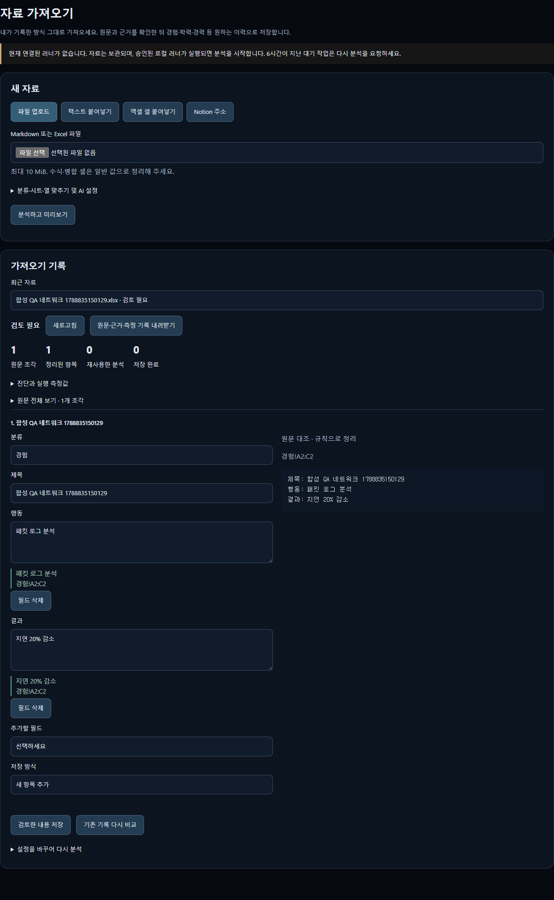

<p align="center"><a href="README.md">한국어</a> · <a href="README.en.md">English</a></p>

# Career Atelier

## 자소서 쓸 때마다, 나를 처음부터 설명하고 있나요?

> “그 프로젝트 내용, 어디에 적어 뒀더라?”
>
> “AI한테 내 경험을 또 붙여 넣어야 하네.”
>
> “문장은 그럴듯한데, 내가 한 일처럼 들리지는 않아.”

**한 번 정리한 내 경험을, 다음 지원의 출발점으로.**
Career Atelier는 흩어진 경험·이력·채용공고를 모으고, 기업 조사부터 자소서 초안·검수·면접 준비까지 이어 주는 개인 취업 준비 작업실입니다.

[에이전트에게 설치 맡기기](#설치가-번거롭다면-에이전트에게-맡기세요) · [화면 둘러보기](#화면으로-둘러보기) · [직접 설치](#시작하기) · [첫 자소서 쓰기](#첫-자소서까지-따라하기) · [문제 해결](#막혔을-때)

<p>
<a href="LICENSE"></a>
<a href="https://github.com/tkv00/Career-Atelier-AI-Context-Pack/releases"></a>

</p>

**개인 설치형 오픈소스** · 내 Supabase에 자료 저장 · 내 PC에서 AI 실행

AI 구독 사용 한도와 호스팅 플랜 조건은 적용됩니다. 필요한 도구는 [직접 설치 안내](#시작하기)에서 확인하세요.

## 설치가 번거롭다면, 에이전트에게 맡기세요

**아래 요청문을 복사해서, 내 PC의 폴더와 터미널을 사용할 수 있는 코딩 에이전트에게 보내세요.** 저장소 다운로드(clone)부터 설치·설정·검사까지 맡길 수 있습니다.

### 아직 다운로드하지 않았다면

```text
Career Atelier를 내 PC에 설치해 줘.
저장소: https://github.com/tkv00/Career-Atelier-AI-Context-Pack.git

저장소를 clone하고 AGENTS.md와 docs/AI-INSTALL.md를 읽은 뒤,
필수 도구 확인 → 의존성 설치 → Supabase 설정 → 검증까지 진행해 줘.
같은 저장소가 이미 있으면 기존 폴더와 변경 사항을 보존해 줘.
로그인·가입·기기 승인 등 내가 직접 해야 하는 단계에서 안내해 줘.
마지막에 실제 검사 결과와 실행 방법을 알려 줘.
```

### 이미 clone했다면

**저장소 폴더를 에이전트에서 열고** 아래 요청문만 보내세요.

```text
현재 Career Atelier 저장소의 AGENTS.md와 docs/AI-INSTALL.md를 읽고
이 폴더에서 설치를 이어서 진행해 줘.
기존 코드와 설정을 보존하고, 설정을 덮어써야 한다면 먼저 확인해 줘.
내가 직접 할 로그인·가입·기기 승인 단계를 안내하고,
검사가 끝나면 실행 명령과 남은 작업을 알려 줘.
```

**직접 할 일은 계정 연결과 승인입니다.**

- 브라우저에서 Supabase와 사용할 AI 계정에 로그인
- 웹에서 첫 계정 생성 → 같은 계정으로 터미널의 러너 로그인
- 관제실에서 내 기기 승인

비밀번호는 에이전트 대화창에 보내지 말고 로그인 화면·터미널에 직접 입력하세요. 설치를 마친 뒤에는 저장소 폴더에서 `npm start`로 실행합니다.

[에이전트용 설치 절차](docs/AI-INSTALL.md) · [직접 설치하기](#시작하기)


*이 문서의 이미지는 저장소에 있는 예시 화면입니다. 회사·일정·경험·작업 상태는 사용 예시이며, 첫 가입 시 자동으로 채워지지 않습니다. 버전에 따라 화면 배치와 문구가 다를 수 있습니다.*

## 화면으로 둘러보기

### “쓸 경험이 없는 게 아니라, 어디에 뒀는지 모르겠어요”

**경험 카드**에 상황·판단·행동·결과를 기록하고 태그로 찾아보세요. 같은 프로젝트도 ‘협업’, ‘문제해결’처럼 다른 문항에 쓸 소재를 찾는 출발점이 됩니다. 학력·경력·자격증은 **이력 정보**에 따로 보관합니다.


### “Notion이랑 엑셀에 이미 정리했는데, 또 입력해야 하나요?”

**자료 가져오기**에서 Markdown·XLSX 파일, 복사한 텍스트·엑셀 셀, Notion 페이지·DB 주소를 받아 정리합니다. **원문과 추출 항목을 대조하고, 고친 뒤 저장**하는 순서입니다. 자유 문서는 선택적으로 로컬 AI가 정리합니다.

가져오기 분석에는 승인된 러너가 필요합니다. Notion은 러너의 별도 연결이 필요하고, 수식·병합 셀은 일반 값으로 정리해 주세요. 모든 자료가 자동으로 완벽하게 변환되는 것은 아니므로 누락·분류·중복을 확인하세요.

<details>
<summary>자료 가져오기 화면 보기 — 원문과 저장할 내용 비교</summary>



*합성 QA 자료를 사용한 검토 예시입니다. 상단의 러너 미연결 안내도 캡처 당시 상태입니다.*

</details>

### “공고는 저장했는데, 마감일이랑 작성 중인 자소서가 따로 놀아요”

**지원 일정**에서 마감일·제출 여부·전형 결과를 확인하고, 저장한 공고에서 자소서 편집기로 이동합니다. 직접 찾은 공고를 입력해도 되고, 모카에게 탐색을 요청해도 됩니다.


<details>
<summary>전형별 진행상황도 보기</summary>


</details>

### “기업 조사부터 초안까지, 매번 대화창을 옮겨 다녀요”

자소서 편집기에 **문항·글자 수·기업·직무·공고 내용**을 넣고 **기업 조사부터 소제목까지 실행 (솔)**을 선택합니다. 솔의 조사 → 뮤즈의 경험 기반 초안 → 렌즈의 근거·과장 검수 → 콤마의 소제목 순서로 이어집니다.

저장한 경험 카드가 있어야 초안을 만들 수 있습니다. 결과를 읽고 사실관계와 문체를 직접 다듬은 뒤 제출하세요. 검수는 사실 확인을 돕는 기능이며, 지원서 자동 제출은 하지 않습니다.

### “AI가 쓴 티가 나요. 내 말투로 쓰고 싶어요”

**프롬프트**에서 비서별 AI 제공자·모델·작성 지침을 고르고 저장합니다. 예를 들어 “내 판단과 행동을 먼저 쓰고, 확인된 수치만 사용하고, 짧은 문장으로 작성해 줘”라는 기준을 다음 작업에 적용할 수 있습니다.


### “자소서 냈다고 끝이 아니죠. 면접에선 뭘 물어볼까요?”

**면접 준비**에서 공통 질문과 기업별 질문·답변을 정리합니다. 에코에게 예상 질문 생성을 요청하고, 내 경험을 말로 설명하는 연습으로 이어 가세요.


[내 작업실 설치하기](#시작하기) · [사용 순서 먼저 보기](#첫-자소서까지-따라하기)

## 첫 자소서까지 따라하기

**처음에는 경험 하나와 공고 하나로 시작하세요.**

1. **내 목표 저장** — 관제실에서 목표 직무·관심 분야를 입력합니다.
2. **경험 하나 준비** — 경험 카드에 상황·판단·행동·결과를 저장합니다. 기존 기록은 자료 가져오기로 옮길 수 있습니다.
3. **지원할 공고 저장** — 지원 일정에서 **+ 직접 일정 입력** → 회사·직무·마감일 입력 → **캘린더에 저장**을 선택합니다.
4. **자소서 열기** — 저장한 공고의 **자소서 쓰기** 또는 **자소서 작성 연결**을 선택합니다.
5. **AI에게 작성 요청** — 문항·글자 수·기업·직무·공고 내용을 입력하고 **기업 조사부터 소제목까지 실행 (솔)**을 선택합니다.
6. **내 글로 마무리** — 초안과 검수 결과를 읽고 사실관계·문체를 수정한 뒤 직접 제출합니다.

경험 카드가 없으면 초안 작성 단계에서 멈춥니다. AI 작업에는 로그인한 CLI와 승인된 러너가 필요합니다.

[버튼별 상세 안내](docs/FEATURE-WALKTHROUGH.ko.md)

## 함께 일하는 7명의 파일럿

우주 작업실에서 각 파일럿은 서로 다른 일을 맡습니다. 캐릭터 아래의 역할을 보고 필요한 비서를 찾아보세요.

<table>
<tr>
<td align="center" width="25%"><br><b>루미</b><br>관심 분야 뉴스</td>
<td align="center" width="25%"><br><b>모카</b><br>채용공고 탐색</td>
<td align="center" width="25%"><br><b>솔</b><br>기업·직무 조사</td>
<td align="center" width="25%"><br><b>뮤즈</b><br>경험 기반 초안</td>
</tr>
</table>

<table>
<tr>
<td align="center" width="33%"><br><b>렌즈</b><br>근거·과장 검수</td>
<td align="center" width="33%"><br><b>콤마</b><br>문항 소제목</td>
<td align="center" width="33%"><br><b>에코</b><br>면접 질문 준비</td>
</tr>
</table>

모카로 공고를 찾고, 자소서 편집기에서 **솔 → 뮤즈 → 렌즈 → 콤마**를 이어서 실행합니다. 루미는 뉴스 조사, 에코는 면접 준비를 맡습니다. 파일럿별 AI 제공자는 **프롬프트**에서 바꿀 수 있습니다.

[설치부터 시작하기](#시작하기) · [비서별 자세한 역할](docs/REFERENCE.ko.md#7명의-비서) · [자주 묻는 질문](docs/FAQ.ko.md)

## 시작하기

직접 설치하는 방법입니다. 명령어가 낯설다면 [에이전트에게 맡기기](#설치가-번거롭다면-에이전트에게-맡기세요)로 시작하세요.

**저장소 폴더에서 `npm start`만 실행하세요.** Windows·macOS·Linux 모두 같은 명령으로, 터미널 하나에서 웹과 러너를 함께 켭니다.

### 1. 최초 한 번 준비

아래 도구와 계정을 준비하세요. Supabase는 내 자료를 저장할 데이터베이스 서비스입니다.

| 준비물 | 확인할 것 |
|---|---|
| Git | 저장소 다운로드에 사용 |
| [Node.js 22.13 이상](https://nodejs.org/en/download) | 웹·러너 실행에 사용 |
| [Supabase 계정](https://supabase.com) | 본인 계정으로 준비 |
| [Supabase CLI](https://supabase.com/docs/guides/local-development/cli/getting-started) | 운영체제별 공식 방법으로 설치. 터미널에서 `supabase` 실행 가능해야 함 |

Windows는 PowerShell 또는 명령 프롬프트, macOS·Linux는 터미널에서 실행합니다.

```bash
git clone https://github.com/tkv00/Career-Atelier-AI-Context-Pack.git
cd Career-Atelier-AI-Context-Pack
npm start
```

이미 내려받았다면 해당 폴더에서 `npm start`만 실행하세요. 설정이 없으면 설치 마법사를 안내하고, 필요한 웹·러너 패키지를 잠금 파일 기준으로 설치한 뒤 둘을 함께 시작합니다. 기존 설정은 재사용합니다. 첫 실행에는 인터넷 연결이 필요하며 몇 분 걸릴 수 있습니다.

### 2. 본인 계정으로 마무리

1. 처음 설정할 때 Supabase 로그인과 프로젝트 선택 안내를 따르세요. 마법사가 프로젝트 정보를 찾고 데이터베이스 마이그레이션을 적용합니다.
2. 출력된 웹 주소(기본 `http://localhost:3000`)를 열고 **처음이에요 · 계정 만들기**에서 본인 이메일과 직접 정한 비밀번호로 가입하세요. 첫 계정만 소유자로 가입할 수 있고, 기존 사용자는 로그인하면 됩니다.
3. 같은 터미널에서 러너 로그인을 요청하면 **웹에서 정한 이메일·비밀번호**를 입력하세요. 비밀번호는 화면에 표시되지 않습니다. Supabase 대시보드 계정이나 DB 비밀번호와는 다릅니다.
4. 웹 **관제실**의 러너 목록에서 이 기기를 승인하세요.

Supabase 로그인·최초 가입·기기 승인은 본인이 직접 해야 합니다. 유효한 러너 세션이 있으면 재사용하고, 본인 터미널에서 로그인이 필요한 경우에만 입력을 요청합니다.

### 3. 사용하는 AI 연결

AI 기능을 쓰려면 AI CLI 하나 이상을 설치하고, **본인의 구독 계정**으로 로그인해야 합니다. 웹·러너 로그인과 AI CLI 로그인은 서로 별개입니다. 셋을 모두 설치할 필요는 없습니다.

| CLI | 기본 배정 비서 (프롬프트에서 변경 가능) |
|---|---|
| Codex (ChatGPT) | 루미 · 모카 · 뮤즈 · 에코 |
| Claude Code | 솔 · 렌즈 |
| Antigravity (Google) | 콤마 |

<details>
<summary>AI CLI 설치·로그인 명령 보기 — 사용하는 제공자 하나부터</summary>

#### Codex로 시작하기

ChatGPT 계정으로 로그인합니다.

```bash
npm install -g @openai/codex
codex --version
codex login
```

브라우저가 열리면 **ChatGPT 계정 로그인**을 선택하세요. 이 서비스는 API 키 과금 방식을 사용하지 않으므로, API 키 로그인은 설정하지 마세요.

#### Claude Code로 시작하기

Claude Pro 또는 Max 구독 계정으로 로그인합니다.

```bash
npm install -g @anthropic-ai/claude-code
claude --version
claude auth login
```

브라우저에서 Claude 계정으로 로그인하고 구독 로그인을 완료하세요.

#### Antigravity로 시작하기

macOS·Linux에서는 다음 명령으로 설치한 뒤 Google 계정으로 로그인합니다.

```bash
curl -fsSL https://antigravity.google/cli/install.sh | bash
agy --version
agy
```

Windows에서는 [Antigravity 공식 사이트](https://antigravity.google)에서 설치 프로그램을 내려받아 안내를 따르세요. 처음 `agy`를 실행하면 Google 로그인을 요청합니다.

</details>

설치 뒤 명령을 찾지 못한다면 터미널을 완전히 닫고 다시 열어 `--version` 명령을 다시 실행하세요. macOS·Linux에서 `npm install -g`가 권한 오류(`EACCES`)로 실패하면 `sudo`를 쓰지 말고 [nvm](https://github.com/nvm-sh/nvm)으로 Node.js를 다시 설치하세요.

로그인이 끝나면 웹 **프롬프트**에서 사용할 비서의 제공자를 설치한 CLI로 지정하고 저장하세요. 로그인하지 않은 CLI에 배정한 비서는 실행할 수 없습니다. 자세한 제공자 안내는 [AI CLI 참고 문서](docs/REFERENCE.ko.md#시작하기)를 확인하세요.

**경험 카드**에 경험을 저장한 뒤 비서 작업을 요청하고 **실행 기록**에서 결과를 확인하세요. AI 작업 중에는 이 터미널과 컴퓨터를 켜 두세요.

### 매일 실행

```bash
npm start
```

터미널에 출력된 웹 주소를 열면 됩니다. **Ctrl+C 한 번**으로 로컬 웹과 러너를 함께 종료합니다. 설치나 가입을 반복할 필요는 없습니다.

<details>
<summary>필요할 때만 쓰는 명령 — 모두 같은 저장소 폴더에서 실행</summary>

| 필요 | 명령 |
|---|---|
| 이미 배포한 웹을 쓰며 로컬 러너만 켜기 | `npm run runner` |
| 로컬 웹만 켜서 자료 관리하기 | `npm run web` |
| 러너 재로그인 또는 서비스 계정 변경 | `npm run login` |
| 러너 연결 진단 | `npm run doctor` |
| Supabase 재설정 또는 업데이트 후 마이그레이션 적용 | `npm run setup` |

일반 실행은 기존 환경 파일을 재사용하며 새 마이그레이션을 적용하지 않습니다. 업데이트 시 [업그레이드 가이드](docs/UPGRADING.md)를 따르세요. 개발용 `web/`·`runner/` 내부 명령은 계속 사용할 수 있습니다.

</details>

## 기능은 어디서 쓰나요?

아래 이름은 웹의 왼쪽 메뉴와 같습니다.

| 메뉴 | 할 수 있는 일 | AI 필요 여부 |
|---|---|---|
| 관제실 | 목표 설정, 루미 뉴스 조사·모카 공고 탐색, Runner 승인 | 조사·탐색에 필요 |
| 지원 일정 | 공고·마감일 저장, 제출·전형 결과 관리, 자소서 편집기 열기 | 수동 관리에는 불필요 |
| 경험 카드 | 경험과 해시태그 관리, 3D 행성 탐색 | 수동 관리에는 불필요 |
| 자료 가져오기 | 파일·텍스트·Notion을 분석하고 원문 대조 후 저장 | 러너 필요, 자유 문서 AI 정리는 선택 |
| 이력 정보 | 학력·경력·자격증 등 저장 | 불필요 |
| 면접 준비 | 에코로 예상 질문 생성, 답변 정리 | 질문 생성에 필요 |
| 프롬프트 | 비서별 AI 제공자·모델·작성 지침 설정 | 설정 저장에는 불필요 |
| 실행 기록 | 대기·실행·완료·실패와 오류 확인 | 조회에는 불필요 |

[기능별 사용 순서](docs/FEATURE-WALKTHROUGH.ko.md) · [7명의 비서와 전체 화면](docs/REFERENCE.ko.md#7명의-비서)

## 막혔을 때

| 증상 | 먼저 확인할 것 |
|---|---|
| 비밀번호가 틀리다고 나옴 | 웹 가입 여부, 서비스 비밀번호, 이메일 확인 상태. [로그인 가이드](docs/AUTH-TROUBLESHOOTING.md) |
| 웹은 되는데 Runner 로그인 실패 | 웹과 Runner의 Supabase 프로젝트가 같은지 확인 |
| 비서가 계속 대기함 | Runner 실행 → 기기 승인 → 해당 AI CLI 로그인 → 프롬프트의 제공자 설정 순서로 확인 |
| 실행 실패 또는 포트 사용 중 | 저장소 폴더에서 `npm start` 실행. 3000번 포트를 쓰는 기존 로컬 웹이 있으면 종료 |
| 패키지 설치 실패 | Node.js 22.13 이상·인터넷 연결·출력된 npm 오류를 확인하고 `npm start` 재실행 |

## 버전과 업데이트

현재 버전은 상단의 버전 배지와 `npm run check:version`으로 확인합니다. 웹·Runner·설치 도구는 같은 제품 버전으로 관리합니다. 실제 발행 여부와 배포 파일은 [GitHub Releases](https://github.com/tkv00/Career-Atelier-AI-Context-Pack/releases)에서 확인하세요.

저장소 최상위에서 `npm run check:version`으로 버전을 확인합니다. 기존 설치를 바꾸기 전 [변경 이력](CHANGELOG.md)과 [업그레이드 안내](docs/UPGRADING.md)를 읽으세요. 개발자는 `npm run verify`로 버전·테스트·타입·린트·빌드를 한 번에 검사합니다.

[패키지·릴리스 정책](docs/RELEASING.md) · [보안 제보](SECURITY.md)

## 필요할 때 더 보기

| 목적 | 안내 |
|---|---|
| 외부에서도 웹 사용 | 저장소 최상위에서 `npm run deploy`. [배포 상세](docs/REFERENCE.ko.md#배포). 외부 AI 요청도 켜진 로컬 Runner 필요 |
| 백업·개인정보·비용 확인 | [백업 범위](docs/REFERENCE.ko.md#데이터-백업) · [개인정보와 비용](docs/PRIVACY-AND-COST.md) |
| 자주 묻는 질문 | [FAQ: 계정·비용·AI·백업·자료 가져오기](docs/FAQ.ko.md) |
| 세부 기능·아키텍처 | [상세 가이드](docs/REFERENCE.ko.md) |
| 개발·기여 | [기여 규칙](CONTRIBUTING.ko.md) · [AGENTS.md](AGENTS.md) |

[MIT License](LICENSE)
