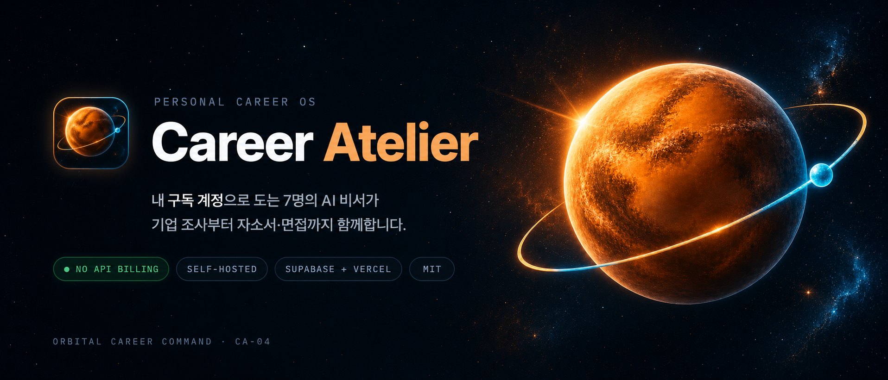
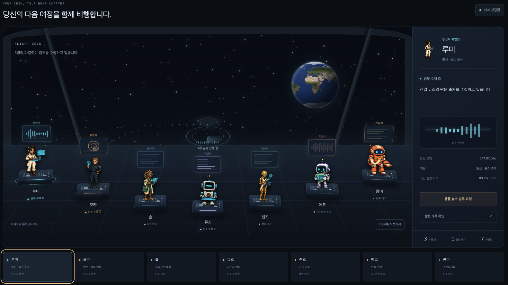
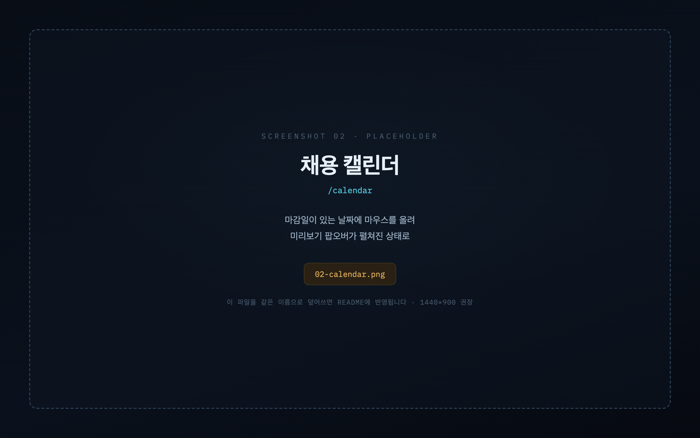
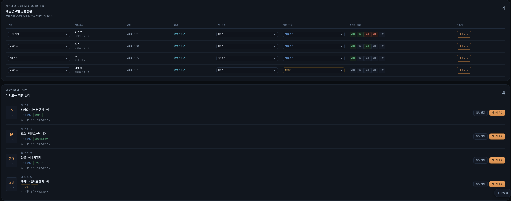
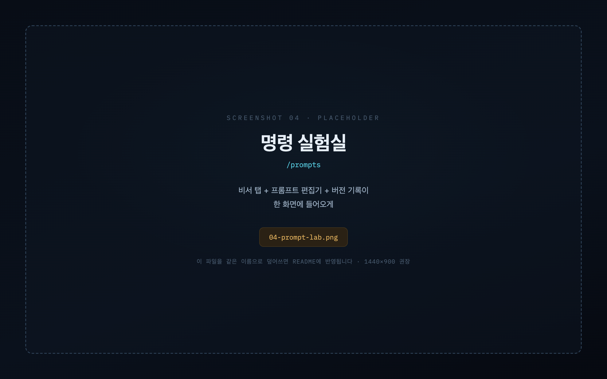
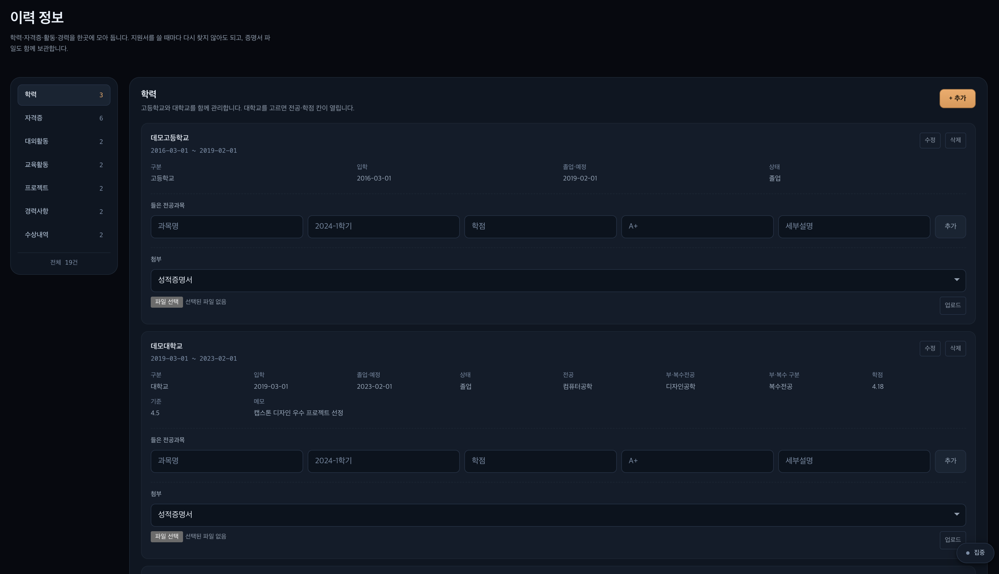
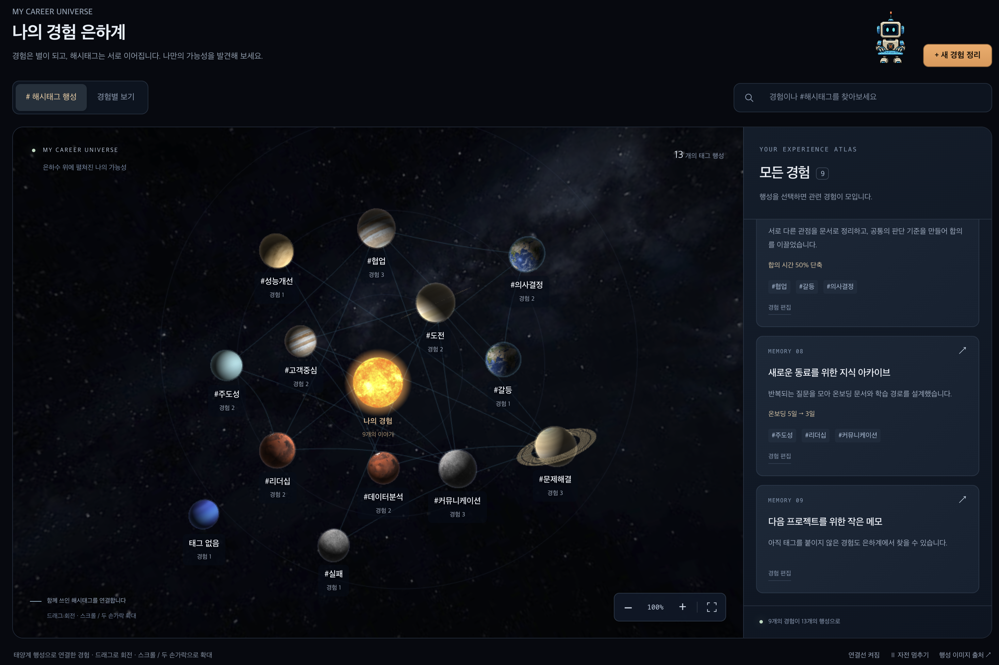
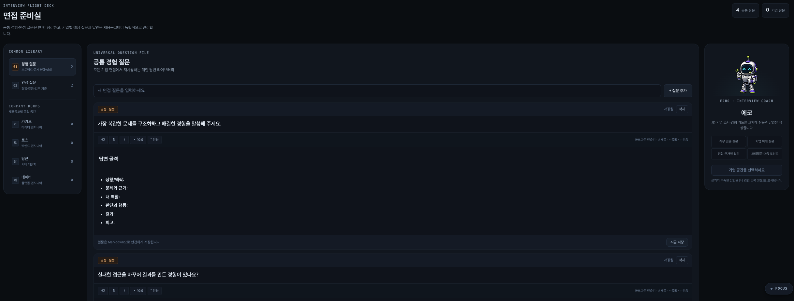

<p>
  
  
  
  
  
  
</p>

**[English](README.md)** · 한국어

---

구독 중인 ChatGPT·Claude·Gemini를 그대로 써서 채용 준비를 도와주는 자체 호스팅 작업실입니다.

토큰당 과금되는 API 키는 쓰지 않습니다. 이미 내고 있는 구독료 안에서 7명의 AI 비서가 뉴스 조사부터 자소서 검수, 면접 준비까지 이어서 처리합니다.


<br>

## 목차

- [왜 만들었나](#왜-만들었나)
- [7명의 비서](#7명의-비서)
- [주요 화면](#주요-화면)
- [구조](#구조)
- [시작하기](#시작하기)
- [AI에게 설치 맡기기](#ai에게-설치-맡기기)
- [MCP로 정리본 일괄 가져오기](#mcp로-정리본-일괄-가져오기)
- [데이터 백업](#데이터-백업)
- [비용이 늘지 않는 이유](#비용이-늘지-않는-이유)
- [기여하기](#기여하기)

<br>

## 왜 만들었나

지원할 때마다 같은 일을 반복합니다.

이 회사가 정확히 뭘 하는지 찾아보고, 최근에 뭘 냈는지 확인하고, 내 경험 중 어떤 게 이 자리와 맞는지 고르고, 비슷한 문항에 예전에 뭐라고 썼는지 다시 뒤집니다.

이 과정을 AI에게 시키려면 보통 두 가지 중 하나를 골라야 합니다. API 키를 발급해 토큰 단위로 돈을 내거나, 매번 챗봇 창에 내 경험을 처음부터 다시 붙여넣거나.

Career Atelier는 세 번째 방법입니다. **이미 구독 중인 CLI 도구**(Codex, Claude Code, Antigravity)를 로컬에서 호출하고, 맥락은 내 데이터베이스에 쌓아 둡니다.

<br>

## 7명의 비서

각 비서는 자기 담당 화면에서 실행되고, 결과는 구조화된 JSON으로 검증된 뒤 저장됩니다.

<br>

<table>
<tr>
<td width="130" align="center"></td>
<td>

### 루미 · 관심 분야 뉴스 조사

**실행** Codex · **저장** `research_notes` (kind: `news`)

`context/01-interests.md`에 적어 둔 관심 분야를 **웹에서 실제로 검색**합니다. 모델이 아는 내용만으로 답하지 않도록 프롬프트에 명시돼 있고, Codex의 자동 `web_search` 도구가 붙습니다.

최근 1~2주 내 뉴스 3~5건을 고르고, 각각 제목·출처·실제 URL·날짜를 함께 반환합니다.

관제실의 루미 카드에서 바로 실행합니다.

</td>
</tr>

<tr>
<td width="130" align="center"></td>
<td>

### 모카 · 채용공고 탐색

**실행** Codex · **저장** `job_posts` → `calendar_events` 자동 연쇄

프로필과 경험 카드를 읽고 맞는 공고를 찾아 적합도(`fit_score`)를 매깁니다. 경험 카드가 없으면 점수를 억지로 올리지 않고 낮게 주거나 빈 결과를 반환합니다.

공고를 저장하면 곧바로 **노바**가 마감일을 정규식으로 파싱해 캘린더에 넣습니다. "상시채용"처럼 마감일이 없는 표기는 일정을 만들지 않습니다.

같은 URL은 새로 만들지 않고 기존 공고를 갱신합니다.

**매일 15시(KST)에 자동 실행됩니다.** 노트북이 꺼져 있었다면 그날 안에 켜질 때 실행되고, 날짜가 넘어가면 건너뜁니다.

</td>
</tr>

<tr>
<td width="130" align="center"></td>
<td>

### 솔 · 기업·직무 조사

**실행** Claude Code · **저장** `research_notes` (kind: `company`)

회사명과 직무를 주면 공시·재무제표·기술 블로그 같은 **1차 자료 중심**으로 조사합니다. 결과에는 출처 URL이 함께 붙습니다.

단순 요약에서 그치지 않고 "이 회사에 지원한다면 어떤 각도로 쓸 수 있는지"까지 제안합니다.

자소서 편집 화면에서 실행하며, 결과는 뮤즈가 초안을 쓸 때 근거로 넘어갑니다.

</td>
</tr>

<tr>
<td width="130" align="center"></td>
<td>

### 뮤즈 · 자소서 초안 작성

**실행** Codex · **저장** `artifacts` (kind: `draft`)

문항과 목표 글자 수를 받아 초안을 씁니다. **근거는 내가 기록한 경험 카드와 솔의 조사 결과 안에서만** 쓸 수 있습니다.

지어내기를 막는 장치가 3겹입니다.

1. 프롬프트에서 근거 밖 사실을 금지
2. 출력 스키마가 문단마다 `evidence` 배열을 요구 — 어떤 경험을 근거로 썼는지 명시
3. **코드가 `experience_id`를 실제 카드와 대조**해, 존재하지 않는 id는 위반으로 기록

초안은 바로 반영되지 않습니다. 저장된 산출물을 확인하고 [반영]을 눌러야 본문이 됩니다.

</td>
</tr>

<tr>
<td width="130" align="center"></td>
<td>

### 렌즈 · 근거 검수

**실행** Claude Code · **저장** `artifacts` (kind: `review`)

완성된 본문을 읽고 과장·근거 없는 주장·직무 부적합을 찾습니다.

지적은 유형이 붙습니다. `fact_error`(사실 오류), `overclaim`(과장), 근거 누락 등으로 나뉘고, 각각 구체적인 수정 제안이 따라옵니다.

경험 카드에 없는 수치를 본문에 쓰면 잡아냅니다.

</td>
</tr>

<tr>
<td width="130" align="center"></td>
<td>

### 에코 · 면접 질문 생성

**실행** Codex · **저장** `interview_questions`

공고·기업 조사·내 경험 카드를 함께 읽고 예상 질문을 만듭니다.

질문은 카테고리(기업·직무·경험 등)로 분류되어 저장되고, 면접 훈련실 화면에서 답변을 적고 다듬을 수 있습니다.

</td>
</tr>

<tr>
<td width="130" align="center"></td>
<td>

### 콤마 · 문항 소제목 제안

**실행** Antigravity (Gemini 3) · **저장** `artifacts` (kind: `subtitle`)

완성된 자소서 본문을 읽고 **15자 이내** 소제목을 제안합니다.

본문에 없는 사실을 만들지 않고 표현만 압축합니다. 새 주장을 만드는 게 아니라서 뮤즈의 3겹 근거 검증은 적용하지 않지만, **본문이 비어 있으면 실행을 거부**합니다.

다른 비서와 마찬가지로 제안일 뿐이고, [반영]을 눌러야 확정됩니다.

</td>
</tr>
</table>

<br>

> **각 비서가 어떤 LLM으로 돌지는 [프롬프트 생성실](#주요-화면)에서 바꿀 수 있습니다.** 위 표는 기본값입니다.
>
> 구독을 하나만 쓴다면 일곱 비서를 전부 그쪽으로 몰아도 됩니다. 스키마는 고른 LLM에 맞게 자동으로 변환됩니다. 다만 **로그인한 CLI가 있어야** 실제로 실행되고, 없으면 실행이 실패로 남습니다.

<br>

## 주요 화면

### 관제실

7명의 상태를 한 화면에서 봅니다. 지금 도는 비서, 마지막 실행 결과, 러너 연결 여부, 오늘 실행 횟수가 보입니다.

루미와 모카는 각자의 카드에서 바로 실행할 수 있습니다.

<!-- 자리표시자 — 이 파일을 실제 캡처로 덮어쓰세요. 규격: docs/images/screens/README.md -->


<br>

### 채용 캘린더

마감일을 달력으로 봅니다. **날짜에 마우스를 올리면** 그날 마감인 공고가 회사명·직무·현재 전형 상태와 함께 목록으로 펼쳐집니다.

<!-- 자리표시자 — 이 파일을 실제 캡처로 덮어쓰세요. 규격: docs/images/screens/README.md -->


<br>

### 전형별 합불 기록

합불을 서류 하나로 뭉뚱그리지 않습니다. **서류 · 필기시험 · 코딩테스트 · 기술면접 · 최종면접**을 따로 기록합니다.

칩을 누를 때마다 `대기 → 합격 → 불합격 → 대기`로 순환합니다.

<!-- 자리표시자 — 이 파일을 실제 캡처로 덮어쓰세요. 규격: docs/images/screens/README.md -->


<br>

### 프롬프트 생성실

각 비서의 시스템 프롬프트를 직접 고칩니다.

저장할 때마다 이전 본문이 버전으로 남고, 언제든 되돌릴 수 있습니다. 되돌리기도 새 버전으로 쌓이기 때문에 기록이 사라지지 않습니다.

<!-- 자리표시자 — 이 파일을 실제 캡처로 덮어쓰세요. 규격: docs/images/screens/README.md -->


<br>

### 나의 정보

학력·자격증·대외활동·교육활동·프로젝트·경력사항·수상내역, 7개 섹션을 항목별로 기록합니다. 사이드바의 **"나의 정보"**에서 들어갑니다.

지원서를 쓸 때마다 학점이나 자격증 등록번호를 다시 찾지 않아도 됩니다. 성적증명서·졸업증명서 같은 파일도 함께 보관하며, 파일은 비공개 저장소에 올라가고 열람할 때만 60초짜리 링크가 만들어집니다.

<!-- 자리표시자 — 이 파일을 실제 캡처로 덮어쓰세요. 규격: docs/images/screens/README.md -->


<br>

### 경험 아카이브

프로젝트 경험을 상황·문제·역할·판단·행동·결과·시행착오·회고로 나눠 기록합니다.

여기 적은 것만 뮤즈가 근거로 쓸 수 있습니다.

<!-- 자리표시자 — 이 파일을 실제 캡처로 덮어쓰세요. 규격: docs/images/screens/README.md -->


<br>

### 면접 훈련실

에코가 만든 질문에 답을 적고 다듬습니다.

<!-- 자리표시자 — 이 파일을 실제 캡처로 덮어쓰세요. 규격: docs/images/screens/README.md -->


<br>

## 구조

```
                    ┌──────────────────────────────┐
브라우저  ───────-> │  Vercel (web/)               │
                    │  · 데이터만 보관              │
                    │  · AI 자격증명 없음           │──┐
                    └──────────────────────────────┘  │
                                                      │  Supabase
                    ┌──────────────────────────────┐  │  Postgres + Auth + RLS
내 컴퓨터 ───────-> │  runner/ (Node)              │<─┘
                    │  · 작업 큐 폴링               │
                    │  · CLI 실행 · 결과 저장        │
                    └───────────┬──────────────────┘
                                │
                    codex · claude · agy
                    (구독 OAuth, 이 기기 밖으로 안 나감)
```

웹 앱은 비서를 직접 실행하지 않습니다. 작업 큐에 한 줄 넣을 뿐입니다.

내 컴퓨터에서 내 계정으로 로그인해 도는 러너가 그 작업을 집어 컨텍스트를 만들고, 알맞은 CLI를 실행하고, 결과를 되돌려 저장합니다.

**러너를 꺼도 사이트는 그대로 동작합니다.** 새 비서 실행만 못 하게 됩니다.

<br>

## 시작하기

순서대로 4단계입니다: 아래 준비물 확인 → 없는 CLI 설치 → 설치 마법사 실행 → 두 프로세스 시작. 아무것도 설치돼 있지 않다고 가정하고 씁니다.

### 준비물

| 항목 | 확인 |
|---|---|
| Node.js 22 이상 | `node -v` |
| Supabase 무료 프로젝트 | [supabase.com](https://supabase.com) |
| Supabase CLI | `npm install -g supabase` |
| AI CLI 최소 1개 | 아래 표 |

<br>

| CLI | 담당 비서 | 설치 · 로그인 |
|---|---|---|
| Codex | 루미 · 모카 · 뮤즈 · 에코 | `npm install -g @openai/codex` → `codex login` |
| Claude Code | 솔 · 렌즈 | `npm install -g @anthropic-ai/claude-code` → `claude auth login` |
| Antigravity | 소제목 | [antigravity.google](https://antigravity.google) 설치 후 `agy` 실행 |

**셋 다 설치할 필요는 없습니다.** 이미 구독 중인 것 하나만 설치하세요. 로그인을 안 해 둔 CLI가 담당하는 비서만 비활성 상태로 남고, 나머지는 그대로 동작합니다.

<br>

<details>
<summary><b>이 CLI들을 한 번도 안 써봤다면 — 완전 처음부터 따라하기</b></summary>

<br>

아래 각 항목은 위 준비물 표의 Node.js 말고는 아무것도 설치돼 있지 않다고 가정합니다.

**Codex CLI (OpenAI)** — ChatGPT Plus·Pro·Team·Business 중 하나가 있어야 합니다.

```bash
npm install -g @openai/codex
codex --version
codex login
```

`codex login`을 실행하면 브라우저가 열립니다. 구독에 쓰는 ChatGPT 계정으로 로그인하고, **API 키가 아니라 구독 로그인**을 선택하세요. 이 프로젝트는 API 키 방식의 과금을 코드 레벨에서 거부하므로, API 키로 로그인을 마쳐도 여기서는 동작하지 않습니다.

**Claude Code CLI (Anthropic)** — Claude Pro 또는 Max 구독이 있어야 합니다.

```bash
npm install -g @anthropic-ai/claude-code
claude --version
claude auth login
```

흐름은 동일합니다. 브라우저가 열리면 Claude 계정으로 로그인하고 구독 로그인을 선택하세요.

**Antigravity CLI (Google)** — Google 계정이 있어야 합니다.

```bash
# macOS · Linux
curl -fsSL https://antigravity.google/cli/install.sh | bash
```

Antigravity는 npm 패키지가 아니므로, Windows에서는 [antigravity.google](https://antigravity.google)에서 설치 프로그램을 내려받아 안내를 따르세요. 이후 과정은 동일합니다.

```bash
agy --version
agy
```

처음 `agy`를 실행하면 브라우저가 열리고 Google 로그인을 요구합니다.

**설치 직후 명령어가 "인식할 수 없습니다"/"command not found"로 나온다면**

터미널을 설치 전에 이미 열어 둔 상태라 새로 추가된 PATH를 못 읽은 것입니다. 터미널을 완전히 닫았다가 새로 열고 `--version` 확인을 다시 시도하세요 — OS를 가리지 않고 가장 흔한 원인입니다.

**macOS·Linux에서 `npm install -g`가 권한 오류(`EACCES`)로 실패한다면**

`sudo`로 다시 실행하지 마세요. 그 순간부터 Node 설치 폴더의 소유권이 root로 넘어가서 이후 다른 권한 오류를 계속 만들어냅니다. 대신 [nvm](https://github.com/nvm-sh/nvm)으로 Node를 설치하세요 — 사용자 홈 디렉터리 안에만 설치되므로 전역 설치에도 관리자 권한이 전혀 필요 없습니다.

로그인은 CLI마다 한 번만 하면 됩니다. 러너를 껐다 켜도 로그인 상태는 유지되므로, 이 절차를 실행할 때마다 반복할 필요는 없습니다 — 기기당 평생 한 번입니다.

CLI 하나라도 로그인에 성공했다면, 아래 "설치 — 명령 3줄"로 넘어가세요. 그 단계는 Supabase를 연결하는 과정이라 CLI와는 무관합니다.

</details>

<br>

### 설치 — 명령 3줄

Windows · macOS · Linux 모두 같은 명령입니다.

```bash
git clone https://github.com/tkv00/Career-Atelier-AI-Context-Pack.git
cd Career-Atelier-AI-Context-Pack
npm run setup
```

**Supabase 대시보드를 열 일도, 키를 복사해 올 일도 없습니다.** 브라우저에서 로그인 한 번만 하면 나머지는 마법사가 합니다.

1. Node · Supabase CLI · AI CLI 설치 상태 확인
2. Supabase 로그인 (브라우저가 한 번 열립니다)
3. 프로젝트 선택 — 없으면 **새로 만들고** 준비될 때까지 대기
4. anon 키를 **직접 조회**해서 가져옴
5. 테이블 · 보안 정책 · 기본 프롬프트 적용
6. `web/.env.local`과 `runner/.env` 생성

> DB 비밀번호는 무작위로 만들고 어디에도 저장하지 않습니다. `service_role` 키는 조회조차 하지 않습니다.

**비밀번호 재설정 메일은 별도 설정 없이 바로 동작합니다** — Supabase 기본 메일 서비스를 쓰기 때문입니다. 다만 시간당 2통으로 제한돼 있어서, 실사용(가끔 비밀번호를 잊었을 때만)에는 충분하지만 가입 흐름을 반복 테스트할 때는 금방 막힙니다. 더 넉넉한 한도가 필요하면 [Resend](https://resend.com)에 무료로 가입해 `supabase/.env.example`을 `supabase/.env`로 복사한 뒤 `RESEND_API_KEY`와 사이트 주소 항목을 채우고 `supabase config push`를 실행하세요.

<br>

### AI에게 설치 맡기기

터미널을 쓸 수 있는 코딩 에이전트(Codex · Claude Code · Gemini CLI · Cursor 등)에 아래 한 줄을 붙여 넣으세요.

```text
다음 설치 지침을 읽고 그대로 따라 Career Atelier를 설치해 줘: https://raw.githubusercontent.com/tkv00/Career-Atelier-AI-Context-Pack/refs/heads/main/docs/AI-INSTALL.md
```

에이전트라면 아래 명령을 순서대로 실행해 끝까지 맡길 수도 있습니다. `--yes`를 주면 아무것도 묻지 않고 끝까지 돕니다.

```bash
git clone https://github.com/tkv00/Career-Atelier-AI-Context-Pack.git
cd Career-Atelier-AI-Context-Pack
npm run setup -- --yes
```

AI는 준비물을 확인하고 공식 저장소 복제, 잠긴 버전의 의존성 설치, 기존 설치 마법사 실행, 빌드 검증까지 진행합니다. 설치 지침에는 API 키 사용, 파괴적인 Git 명령, 환경변수 파일의 무단 덮어쓰기, 자동 배포를 금지하는 안전 규칙도 들어 있습니다. 로그인과 인스턴스 소유권 확인은 직접 해야 합니다. 전체 절차는 실행 전에 [docs/AI-INSTALL.md](docs/AI-INSTALL.md)에서 확인할 수 있습니다.

> 일반 웹 채팅이 아니라 **내 컴퓨터의 터미널 권한이 있는 코딩 에이전트**에서 사용하세요. 웹 채팅만으로는 로컬 프로그램을 설치할 수 없습니다.

리포를 이미 받아 둔 뒤라면 따로 붙여 넣을 것도 없습니다. 루트의 [AGENTS.md](AGENTS.md)를 Codex·Gemini CLI·Cursor·Copilot 등이 **알아서 읽습니다**([AGENTS.md 규약](https://agents.md), 6만 개 이상 저장소가 씁니다). Claude Code는 [CLAUDE.md](CLAUDE.md)를 읽고, 그 파일은 같은 내용을 가리킵니다.

<br>

### 실행

터미널 두 개가 필요합니다.

```bash
# 1번 창 — 웹 앱
cd web
npm install
npm run dev
```

```bash
# 2번 창 — 러너
cd runner
npm install
npm run login
npm run start
```

http://localhost:3000 에 접속해 본인 이메일과 비밀번호로 계정을 만듭니다.

> **가장 먼저 가입한 계정이 그 인스턴스의 소유자가 되고, 이후 가입은 전부 거부됩니다.** 첫 가입을 본인 이메일로 하세요.

마지막으로 관제실 화면 아래 "러너" 목록에서 이 기기를 **승인**하면 작업을 받기 시작합니다. 기기마다 한 번만 하면 됩니다.

<br>

### 배포

Vercel 프로젝트의 Root Directory를 `web/`로 잡고 환경변수 두 개만 넣습니다.

```
NEXT_PUBLIC_SUPABASE_URL
NEXT_PUBLIC_SUPABASE_ANON_KEY
```

service_role 키나 AI 제공자 키는 넣지 마세요. **일부러 빌드가 거부합니다** (`web/lib/env.ts`).

자세한 내용은 [docs/V2-SETUP.md](docs/V2-SETUP.md)에 있습니다.

<br>

## MCP로 정리본 일괄 가져오기

경험 정리본은 이미 어딘가에 있을 겁니다. Notion 페이지든, 몇 달째 쌓아 온 Markdown 파일이든, 이미 정리해 둔 내용을 웹 화면에서 손으로 일일이 다시 입력할 필요가 없습니다.

Career Atelier에는 그 정리본을 읽어 알맞은 데이터베이스 테이블에 바로 넣어 주는 자체 MCP 서버가 포함되어 있습니다.

### 어떤 MCP 서버인가

stdio 위에서 JSON-RPC 2.0으로 통신하는 로컬 툴 전용 MCP 서버입니다. 툴 3개(`preview_import`, `import_records`, `db_snapshot`)를 제공하며 외부 라이브러리 의존성이 없습니다.

목적은 편의성뿐 아니라 토큰 비용 절감입니다. 에이전트에게 "이 정리본을 읽고 데이터베이스에 넣어 달라"고 요청하면 문서 전체가 모델 컨텍스트로 들어가고, 모델이 이를 다시 INSERT 인자로 생성해야 하므로 동일한 텍스트에 대해 불필요한 토큰이 중복 소비됩니다. 이 MCP 서버는 소스를 직접 파싱해 로컬에서 데이터베이스로 직접 기록하므로, 모델은 소스 경로와 처리 결과 영수증만 주고받습니다. 정리본 원문이 모델 컨텍스트를 통과하지 않아 토큰 소비를 96% 이상 줄입니다.

### Claude 전용이 아닙니다

Anthropic 전용 라이브러리를 쓰지 않으므로, 표준 MCP를 지원하는 클라이언트라면 모두 연동할 수 있습니다. 이 프로젝트에서 사용하는 3개 CLI 모두 지원합니다.

| 클라이언트 | 등록 방법 |
|---|---|
| Claude Code | 리포 루트 `.mcp.json`에 이미 등록돼 있음 |
| Codex | `codex mcp add career-atelier -- node <리포>/runner/mcp/server.mjs` |
| Antigravity | `agy mcp add career-atelier -- node <리포>/runner/mcp/server.mjs` |

Cursor, Windsurf, Cline, Zed 등에서도 동일한 방식으로 연결할 수 있습니다.

### 툴 3개

| 툴 | 역할 |
|---|---|
| `preview_import` | 무엇이 저장될지 미리 확인합니다. DB에 아무것도 쓰지 않습니다. |
| `import_records` | 실제로 저장합니다. 기본값이 `dry_run: true`이므로 실제 반영 시 `dry_run: false`를 전달합니다. |
| `db_snapshot` | 각 테이블별 현재 행 수를 조회합니다. 임포트 전후 데이터 비교에 씁니다. |

동일한 정리본을 다시 가져오더라도 중복 행이 생기지 않고 해당 항목이 갱신되므로 안전합니다.

### 정리본 형식

1단계 제목(`#`)이 대상 테이블을 지정하고, 2단계 제목(`##`)이 개별 항목을 시작하며, `- 키: 값` 목록으로 상세 필드를 채웁니다. [`runner/mcp/fixtures/sample-notes.md`](runner/mcp/fixtures/sample-notes.md)에서 실제 동작하는 예시를 확인할 수 있습니다.

```markdown
# 경험
## 교내 스터디 운영진
- 상황: 3개월간 출석률이 40%까지 떨어져 있었다
- 결과: 3개월 뒤 85%로 회복
- 수치: 출석률 40%->85%, 인원 12명->19명
```

인식 가능한 섹션은 기본정보, 학력, 자격증, 대외활동, 교육활동, 프로젝트, 경력사항, 수상내역, 경험입니다. 필드명은 다양한 한국어 별칭을 지원하며, 구조에 맞지 않는 내용은 누락되지 않고 `skipped` 목록으로 반환됩니다.

### 터미널에서 직접 실행

```bash
cd runner
node mcp/server.mjs preview --source /경로/정리본.md
node mcp/server.mjs import  --source /경로/정리본.md --write
```

### Notion에서 가져오기

Notion 내부 통합을 생성하고 가져올 페이지를 해당 통합에 공유한 뒤, `runner/.env`에 `NOTION_TOKEN=secret_...`을 추가하고 소스로 `notion://page/<id>` 또는 `notion://database/<id>`를 넘기면 됩니다.

<br>

## 데이터 백업

Supabase 무료 플랜은 장기간 미사용 시 프로젝트가 일시 정지될 수 있습니다. 중요한 자소서와 이력 데이터의 안전을 위해 로컬 백업 기능을 제공합니다.

관제실 화면의 러너 항목에서 로컬 폴더 자동 백업을 활성화하고 절대 경로를 지정하세요.

- macOS · Linux: `~/career-atelier-backups`
- Windows: `C:\career-atelier-backups`

러너가 켜져 있는 동안 2시간 주기로 전체 데이터베이스를 JSON 파일로 로컬에 백업합니다. 하루에 1개 파일로 관리되어 디스크 용량을 낭비하지 않습니다.

백업 작업은 브라우저가 아닌 로컬 머신의 러너 프로세스가 수행하므로, 러너가 켜져 있을 때 동작합니다.

<br>

## 비용이 늘지 않는 이유

추가 비용이 없다는 것은 토큰 단위의 유료 API 과금이 없다는 의미입니다. 기존에 구독 중인 플랜의 범위 안에서 동작합니다.

러너가 강제하는 안전 원칙:

- 자식 프로세스에서 `OPENAI_API_KEY`, `ANTHROPIC_API_KEY` 등 유료 API 환경변수를 제거합니다.
- 실행 직전 각 CLI가 개인 구독 로그인 상태인지 검증합니다.
- Claude의 유료 초과 과금 신호가 감지되면 즉시 실행을 중단합니다.
- 사용량 한도에 도달하면 API로 우회하지 않고 `waiting_for_reset` 상태로 안전하게 대기합니다.

| 안전 상한 | 고정값 |
|---|---|
| 일일 실행 | 40회 |
| 동시 실행 | 1개 |
| 단일 실행 타임아웃 | 15분 |
| 재시도 | 0회 |
| 작업 유효기간 | 6시간 |

<br>

## 기여하기

버그 제보, 문서 개선, 기능 제안, 코드 기여를 모두 환영합니다. 개발 환경 설정과 Pull Request 제출 기준은 [CONTRIBUTING.ko.md](CONTRIBUTING.ko.md) 및 [CONTRIBUTING.md](CONTRIBUTING.md)에서 확인하실 수 있습니다.

각자 독립된 Supabase 프로젝트를 생성해 개발하므로 공용 개발 데이터베이스 충돌 없이 안전하게 작업할 수 있습니다.

<br>

## 문서

| 문서 | 내용 |
|---|---|
| [docs/USER-GUIDE.md](docs/USER-GUIDE.md) | OS별 설치 및 사용 가이드 |
| [docs/AI-INSTALL.md](docs/AI-INSTALL.md) | 코딩 에이전트를 위한 자동 설치 가이드 |
| [docs/V2-SETUP.md](docs/V2-SETUP.md) | Supabase 및 Vercel 수동 설정 및 배포 |
| [docs/PRIVACY-AND-COST.md](docs/PRIVACY-AND-COST.md) | 개인정보 보호 및 비용 무과금 보장 모델 |
| [docs/HARNESS-ENGINEERING.md](docs/HARNESS-ENGINEERING.md) | 하네스 엔지니어링 및 에이전트 개발자 가이드 |
| [runner/README.md](runner/README.md) | 러너 프로세스 내부 구조 및 실행 안내 |
| [runner/mcp/README.md](runner/mcp/README.md) | 로컬 MCP 서버 도구 및 포맷 규약 |
| [CONTRIBUTING.ko.md](CONTRIBUTING.ko.md) | 오픈소스 기여 가이드 (한국어) |
| [CONTRIBUTING.md](CONTRIBUTING.md) | Contribution Guidelines (English) |

<br>

## 라이선스

MIT License - [LICENSE](LICENSE)

