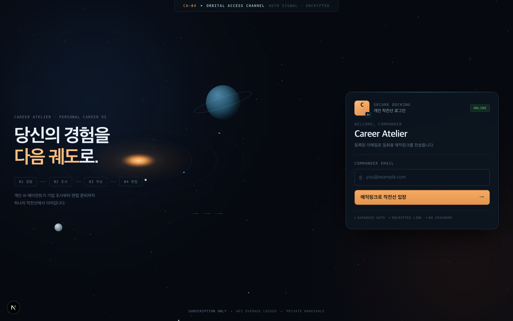

<p>
  
  
  
  
  
  
</p>

English · **[한국어](README.ko.md)**

---

A self-hosted job-application workspace that runs on the ChatGPT, Claude, and Gemini subscriptions you already pay for.

No metered API keys. Seven AI agents handle everything from industry research to cover-letter review and interview prep, inside your existing subscription.



<br>

## Contents

- [Why this exists](#why-this-exists)
- [The seven agents](#the-seven-agents)
- [Screens](#screens)
- [Architecture](#architecture)
- [Getting started](#getting-started)
- [Backups](#backups)
- [Why your bill does not grow](#why-your-bill-does-not-grow)
- [Contributing](#contributing)

<br>

## Why this exists

Every application repeats the same work.

Look up what the company actually does. Check what they shipped recently. Pick which of your experiences fit this role. Dig up what you wrote for a similar question last time.

Handing that to an AI usually means one of two things: pay per token with an API key, or paste your whole history into a chat window again every session.

Career Atelier is a third option. It calls the **CLI tools you already subscribe to** (Codex, Claude Code, Antigravity) on your own machine, and keeps the context in your own database.

<br>

## The seven agents

Each agent runs from the screen it belongs to. Output is validated against a JSON schema before anything is stored.

<br>

<table>
<tr>
<td width="130" align="center"></td>
<td>

### Lumi — industry news research

**Runs on** Codex · **Writes to** `research_notes` (kind: `news`)

Takes the fields you listed in `context/01-interests.md` and **actually searches the web** for them. The prompt forbids answering from model memory alone, and Codex's automatic `web_search` tool does the lookup.

Returns three to five items from the last week or two, each with a title, source, real URL, and date.

Launch it from Lumi's card on the dashboard.

</td>
</tr>

<tr>
<td width="130" align="center"></td>
<td>

### Moka — job posting discovery

**Runs on** Codex · **Writes to** `job_posts` → cascades into `calendar_events`

Reads your profile and experience cards, finds matching postings, and scores each one (`fit_score`). With no experience cards recorded it scores conservatively or returns nothing rather than inflating the match.

Saving a posting immediately triggers **Nova**, which parses the deadline with regular expressions and files it on the calendar. Rolling postings with no real deadline get no calendar entry at all.

The same URL updates the existing posting instead of creating a duplicate.

**Runs automatically at 15:00 KST daily.** If your laptop was asleep it runs when you next open it that day, and skips entirely once the date rolls over.

</td>
</tr>

<tr>
<td width="130" align="center"></td>
<td>

### Sol — company and role research

**Runs on** Claude Code · **Writes to** `research_notes` (kind: `company`)

Give it a company and a role and it researches from **primary sources**: public filings, financial statements, engineering blogs. Every finding carries its source URL.

It goes past summarising and proposes angles you could actually write about for that specific company.

Launch it from the cover-letter editor. Its findings become evidence for Muse.

</td>
</tr>

<tr>
<td width="130" align="center"></td>
<td>

### Muse — cover-letter drafting

**Runs on** Codex · **Writes to** `artifacts` (kind: `draft`)

Takes a question and a target length and writes a draft. It may **only** draw on experience cards you recorded and research Sol produced.

Three layers stop it from inventing things:

1. The prompt forbids facts outside the supplied evidence.
2. The output schema requires an `evidence` array per paragraph, naming which experience backs it.
3. **Code cross-checks every `experience_id` against your real cards** and records any that do not exist as violations.

Drafts do not apply themselves. You review the stored artifact and click to accept it.

</td>
</tr>

<tr>
<td width="130" align="center"></td>
<td>

### Lens — evidence review

**Runs on** Claude Code · **Writes to** `artifacts` (kind: `review`)

Reads a finished draft and flags overclaims, unsupported assertions, and poor fit for the role.

Findings are typed as `fact_error`, `overclaim`, or missing evidence, and each comes with a concrete rewrite suggestion.

Put a number in your draft that appears in none of your experience cards and Lens will catch it.

</td>
</tr>

<tr>
<td width="130" align="center"></td>
<td>

### Echo — interview question generation

**Runs on** Codex · **Writes to** `interview_questions`

Reads the posting, the company research, and your experience cards together, then produces likely questions.

Questions are stored by category (company, role, experience) so you can draft and refine answers in the practice room.

</td>
</tr>

<tr>
<td width="130" align="center">

**Sojemok**

<sub>(no artwork yet)</sub>

</td>
<td>

### Sojemok — section headings

**Runs on** Antigravity (Gemini 3) · **Writes to** `artifacts` (kind: `subtitle`)

Reads a finished cover letter and proposes headings of **15 characters or fewer**.

It compresses your own wording rather than adding claims, so Muse's three-layer evidence check does not apply here. It **refuses to run on an empty draft**.

Like every other agent, its output is a suggestion until you accept it.

</td>
</tr>
</table>

<br>

> **An agent only works if its CLI is logged in.** You do not need all three. With just Codex you get Lumi, Moka, Muse, and Echo; the rest will fail if you launch them.

<br>

## Screens

### Dashboard

All seven agents at a glance: which one is running, how the last run ended, whether the runner is connected, and how many runs you have used today.

Lumi and Moka launch directly from their own cards.

<!-- PLACEHOLDER — replace this file with a real capture. Spec: docs/images/screens/README.md -->


<br>

### Application calendar

Deadlines on a month grid. **Hover a date** and every posting due that day expands into a list with company, role, and current stage.

<!-- PLACEHOLDER — replace this file with a real capture. Spec: docs/images/screens/README.md -->


<br>

### Per-stage outcomes

Outcomes are not collapsed into one pass/fail. **Resume screen, written test, coding test, technical interview, and final interview** are tracked separately.

Each chip cycles through pending → passed → failed on click.

<!-- PLACEHOLDER — replace this file with a real capture. Spec: docs/images/screens/README.md -->


<br>

### Prompt studio

Edit each agent's system prompt directly.

Every save keeps the previous body as a version you can restore at any time. Restoring is itself a new version, so nothing is ever lost.

<!-- PLACEHOLDER — replace this file with a real capture. Spec: docs/images/screens/README.md -->


<br>

### Personal dossier

Education, certifications, activities, training, projects, work history, and awards, each with its own fields.

You stop re-finding your GPA or a certificate registration number for every application. Supporting documents such as transcripts live here too — files go to a private bucket, and opening one mints a 60-second signed link rather than exposing a public URL.

<br>

### Experience archive

Record project experience broken into context, problem, your role, judgement, actions, results, missteps, and reflection.

Only what you record here can be used as evidence by Muse.

<!-- PLACEHOLDER — replace this file with a real capture. Spec: docs/images/screens/README.md -->


<br>

### Interview practice

Draft and refine answers to the questions Echo generated.

<!-- PLACEHOLDER — replace this file with a real capture. Spec: docs/images/screens/README.md -->


<br>

## Architecture

```
                    ┌──────────────────────────────┐
Browser  ─────────▶ │  Vercel (web/)               │
                    │  · holds data                │
                    │  · holds no AI credentials   │──┐
                    └──────────────────────────────┘  │
                                                      │  Supabase
                    ┌──────────────────────────────┐  │  Postgres + Auth + RLS
Your machine ─────▶ │  runner/ (Node)              │◀─┘
                    │  · polls the job queue       │
                    │  · runs CLIs, stores results │
                    └───────────┬──────────────────┘
                                │
                    codex · claude · agy
                    (subscription OAuth, never leaves this machine)
```

The web app never runs an agent. It writes one row into a job queue.

The runner is a Node process on your machine, signed in as you. It claims the job, builds a context pack, invokes the right CLI, and writes the results back.

**Turn the runner off and the site still works.** You just cannot start new agent runs.

<br>

## Getting started

### Requirements

| Item | Check |
|---|---|
| Node.js 22+ | `node -v` |
| A free Supabase project | [supabase.com](https://supabase.com) |
| Supabase CLI | `npm install -g supabase` |
| At least one AI CLI | see below |

<br>

| CLI | Powers | Install · sign in |
|---|---|---|
| Codex | Lumi · Moka · Muse · Echo | `npm install -g @openai/codex` → `codex login` |
| Claude Code | Sol · Lens | `npm install -g @anthropic-ai/claude-code` → `claude auth login` |
| Antigravity | Sojemok | install from [antigravity.google](https://antigravity.google), then run `agy` |

<br>

### Install

The same command on Windows, macOS, and Linux.

```bash
git clone https://github.com/tkv00/Career-Atelier-AI-Context-Pack.git
cd Career-Atelier-AI-Context-Pack
npm run setup
```

`npm run setup` will:

1. Check Node, the Supabase CLI, and your AI CLIs
2. Link your Supabase project
3. Apply tables, row level security, and the default prompts
4. Write `web/.env.local` and `runner/.env`

<br>

### Run

You need two terminals.

```bash
# terminal 1 — web app
cd web && npm install && npm run dev
```

```bash
# terminal 2 — runner
cd runner && npm install && npm run login && npm run start
```

Open http://localhost:3000 and sign in with your own email.

> **The first account to sign up becomes the owner of that instance, and every later signup is rejected.** Make sure the first sign-in is yours.

Finally, **approve** this machine in the runner list at the bottom of the dashboard. Once per device.

<br>

### Deploying

Point a Vercel project at the `web/` directory and set two environment variables.

```
NEXT_PUBLIC_SUPABASE_URL
NEXT_PUBLIC_SUPABASE_ANON_KEY
```

Do not add a service role key or any AI provider key. **The build rejects them on purpose** (`web/lib/env.ts`).

Details in [docs/V2-SETUP.md](docs/V2-SETUP.md).

<br>

## Backups

Supabase pauses free-tier projects that go unused, and a single cloud database is a single point of failure for writing you cannot easily reproduce.

Turn on **local folder backup** in the dashboard's runner section and give it an absolute path.

- macOS · Linux — `~/career-atelier-backups`
- Windows — `C:\career-atelier-backups`

While the runner is up it writes a full JSON export every six hours, one file per day so the folder stays bounded.

> The runner writes backups, not the browser, because a web page cannot write to an arbitrary folder on your disk. **No runner, no backup.**

<br>

## Why your bill does not grow

"No extra cost" means **no per-token API billing**. Your subscription fee is unchanged, and your plan's usage limits still apply.

What the runner enforces:

- **Strips API key variables** such as `OPENAI_API_KEY` and `ANTHROPIC_API_KEY` from child processes.
- **Verifies each CLI is on a subscription login** before running. If not, it does not run.
- **Halts immediately** when Claude signals paid overage.
- Stops at `waiting_for_reset` when you hit a usage limit, rather than falling back to an API.

These are fixed in code and cannot be switched off from the UI.

| Safety limit | Value |
|---|---|
| Runs per day | 40 |
| Concurrent runs | 1 |
| Single run timeout | 15 min |
| Retries | 0 |
| Job expiry | 6 hours |

<br>

## Contributing

Contributions are welcome. Development setup and PR expectations are in [CONTRIBUTING.md](CONTRIBUTING.md).

Everyone develops against their own Supabase project, so **there is no shared dev database to break.**

Good places to start:

- The runner is still macOS-first in places. Real Windows and Linux testing is especially useful.
- Agents live in `runner/context-pack.mjs` and `runner/providers/`. Adding a provider means adding one file.
- Sojemok has no character artwork yet.
- The practice room and prompt studio have the thinnest verification.

<br>

## Documentation

| Document | Covers |
|---|---|
| [docs/USER-GUIDE.md](docs/USER-GUIDE.md) | Per-OS install and usage |
| [docs/V2-SETUP.md](docs/V2-SETUP.md) | Supabase and Vercel setup |
| [docs/DESIGN-V2-CLOUD.md](docs/DESIGN-V2-CLOUD.md) | Design decisions and rationale |
| [docs/PRIVACY-AND-COST.md](docs/PRIVACY-AND-COST.md) | Privacy and cost guarantees |
| [runner/README.md](runner/README.md) | Runner internals and verification log |

<br>

## License

MIT — [LICENSE](LICENSE)
