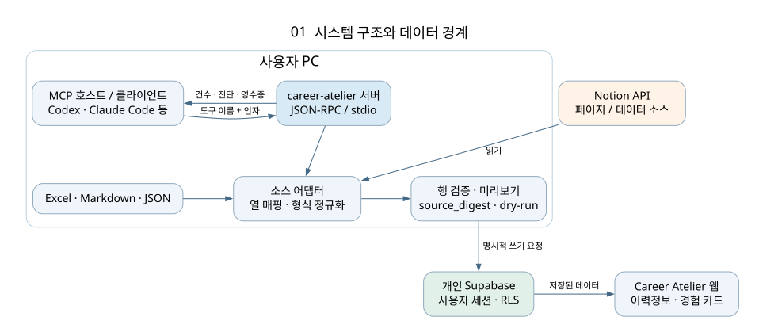
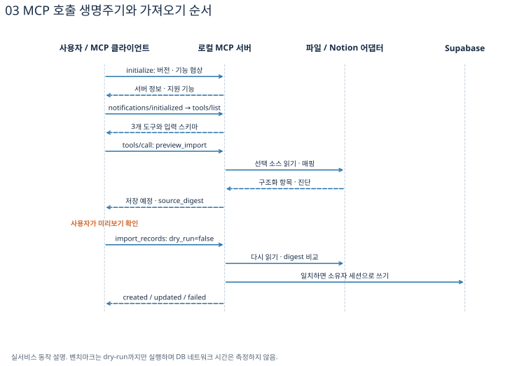
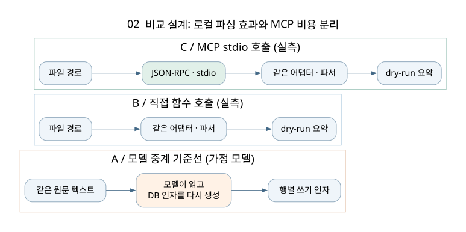
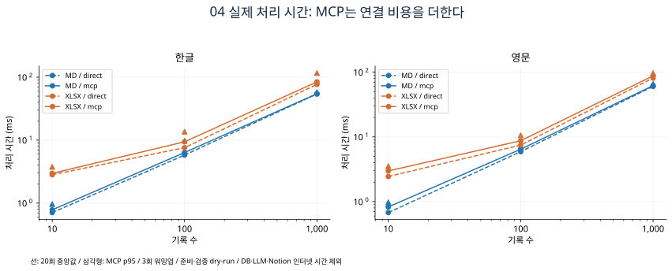

# 경험 정리본을 다시 입력하지 않기 위해: Excel·Notion 가져오기를 로컬 MCP로 설계한 과정

> 기술 블로그 초안. 2026-09-06의 구현과 저장된 실험 결과를 기준으로 작성했다. 아래의 구현 단계는 현재 코드의 의존 관계에 맞춰 설명한 순서이며, 별도로 기록하지 않은 시행착오를 실제로 겪은 일처럼 재구성하지 않았다. 실제 에이전트 토큰 측정은 아직 수행하지 않았다.

## 1. 출발점은 AI 기능보다 자료를 옮기는 일이었다

Career Atelier를 만들게 된 계기는 취업 준비 자료가 여러 곳에 흩어져 있었기 때문이다. 이력정보와 경험은 Notion에, 지원할 기업과 진행 상황은 엑셀이나 별도 표에, 기업분석과 자기소개서는 GPT나 Claude 대화창에 쌓였다. 지원할 때마다 자료를 찾고 복사하고, AI에게 내 경험을 다시 설명해야 했다.

서비스 안에 경험 카드를 만들더라도 이 문제가 저절로 해결되지는 않았다. 기존에 정리한 경험을 새 서비스에 다시 입력해야 한다면, 사용자는 서비스를 써 보기 전에 자료 이전부터 해야 한다. 이미 잘 정리한 사람이 오히려 더 많은 복사·붙여넣기를 해야 하는 셈이다.

그래서 가져오기 기능의 목표를 “AI가 문서를 읽어 준다”보다 구체적으로 잡았다.

**사용자가 선택한 경험 정리본을 읽고, 어떤 데이터가 어디에 들어갈지 확인한 뒤, 기존 서비스의 경험 카드와 이력정보로 옮긴다.**

이를 위해 필요한 일은 네 가지였다. 서로 다른 소스를 읽는 일, 열과 필드의 의미를 연결하는 일, 저장 가능한 형태로 검증하는 일, 기존 데이터와 충돌할 때의 동작을 정하는 일이다. MCP를 붙이는 작업은 이 기능을 AI 클라이언트에서 발견하고 호출할 수 있도록 만드는 단계다.

## 2. 처음부터 모든 문서를 AI로 해석하지 않은 이유

경험 정리본을 가져오는 가장 직관적인 방법은 모델에게 원문을 읽히고 서비스 형식의 JSON으로 변환하도록 요청하는 것이다. 자유 서술을 이해하거나 서로 다른 표현을 연결하는 데는 장점이 있다.

하지만 구조가 이미 있는 표에서는 불필요한 재작성도 발생한다. 엑셀에 제목·상황·행동·결과가 각각 열로 나뉘어 있다면, 그 행을 DB 필드로 연결하는 데 반드시 모델의 추론이 필요한 것은 아니다. 원문이 모델 입력에 들어가고, 같은 내용을 저장 도구의 인자로 다시 생성하면 전달량과 변동성이 생긴다.

특히 이 서비스에서 경험은 자기소개서의 근거다. 가져오는 과정에서 성과 수치가 바뀌거나, 역할이 확대 해석되거나, 없는 내용을 보충하면 이후 작성 단계의 근거까지 흔들린다. 가져오기 단계에서는 사용자가 쓴 사실을 보존하는 쪽을 우선했다.

현재 구현은 별칭·열 매핑·명시적 규칙으로 처리한다. 규칙에 맞지 않는 자유 서술을 자동으로 LLM에 넘기는 폴백은 넣지 않았다. 파싱 단계의 결과를 재현하고, 실패 이유를 사용자에게 설명하기 위해서다.

이 선택에는 비용이 있다. “내가 했던 일들”이라는 제목 아래 자유롭게 적힌 문서를 어떤 경험과 필드로 나눌지는 현재 파서가 이해하지 못한다. 이 경우에는 제목·열·필드 이름을 정리해야 한다. **지금 만든 것은 구조화된 정리본의 이관 도구이며, 어떤 문서든 이해하는 범용 추출기는 아니다.**

## 3. 파일 업로드나 CLI도 가능한데 왜 MCP를 도입했는가

파일을 읽고 저장하는 함수만 있으면 가져오기는 가능하다. 실제 구현에서도 MCP 없이 터미널에서 같은 파이프라인을 실행할 수 있다. MCP가 있어야 엑셀을 읽을 수 있는 것은 아니다.

MCP를 선택한 이유는 Career Atelier의 사용 방식에 있다. 사용자는 자신의 AI CLI를 사용하고, 클라이언트나 모델을 바꿀 수 있다. 클라이언트마다 전용 가져오기 연동을 만드는 대신, 같은 도구 정의와 호출 규약을 재사용하고 싶었다.

| 후보 | 잘하는 일 | 이번 요구에서 고려한 비용 |
|---|---|---|
| 웹 파일 업로드 | 사용자가 버튼으로 바로 시작하기 쉽다 | 업로드·보관·웹 인증 흐름을 추가해야 하고 로컬 Notion 자격증명 경계를 다시 설계해야 한다 |
| 독립 CLI | 단순하고 직접 호출 비용이 작다 | 사용자가 명령과 인자를 알고 실행해야 한다 |
| 클라이언트별 도구 연동 | 각 클라이언트 UX에 맞출 수 있다 | 클라이언트별 구현·문서·테스트가 늘어난다 |
| 로컬 MCP | 같은 가져오기 기능을 여러 AI 클라이언트에서 발견하고 호출한다 | 프로세스 실행, 통신, 도구 스키마, 클라이언트 설정 비용이 추가된다 |
| 모델이 원문을 읽고 재작성 | 불규칙한 서술을 해석하기 유리하다 | 모델 사용량·출력 변동·근거 보존 검증이 필요하다 |

현재 선택은 로컬 파서를 핵심으로 두고 CLI와 MCP가 이를 공유하는 방식이다. 웹에서 쓰는 사람에게는 업로드 UI가 더 편리할 수 있으므로 장기적으로 배제한 선택은 아니다. 이번 구현의 UI는 웹 버튼이 아니라 로컬 MCP 클라이언트와 터미널이다.

기성 Notion MCP도 유용하다. 다만 Notion 내용을 읽어 주는 범용 도구만으로는 Career Atelier의 경험 필드, 자연키, 저장 전 검증까지 해결되지 않는다. 내가 필요한 것은 소스 접근과 서비스의 저장 규칙을 한 흐름으로 연결하는 도구였다. 기성 MCP가 항상 원문을 모두 반환하거나 반드시 더 많은 토큰을 쓴다는 뜻은 아니다. 도구의 응답과 사용 방식에 따라 달라진다.

## 4. MCP를 이해하기 위한 세 가지 구분

### 4.1 호스트·클라이언트·서버

호스트는 사용자가 대화하는 앱이다. 클라이언트는 그 앱 안에서 MCP 서버와 연결을 유지하는 구성요소다. 서버는 사용할 수 있는 기능과 그 입력 형식을 제공한다.

이 프로젝트에 대입하면 다음과 같다.

| 구성요소 | 이 프로젝트에서의 역할 |
|---|---|
| 호스트 | Codex, Claude Code 같은 사용자 앱 |
| MCP 클라이언트 | 서버 프로세스를 연결하고 요청·응답을 전달하는 부분 |
| MCP 서버 | runner/mcp/server.mjs |
| 소스 어댑터 | Excel·Markdown·JSON·Notion 읽기 |
| 저장 계층 | 기존 사용자 세션으로 Supabase에 반영 |
| 모델 | 호스트가 도구 선택과 사용자 응답을 위해 사용하는 추론 구성요소 |

MCP 서버 자체가 모델은 아니다. 이 서버의 파일 파싱과 행 매핑은 Node 코드가 수행한다. [MCP 아키텍처 규격](https://modelcontextprotocol.io/specification/2025-06-18/architecture)

### 4.2 Tools·Resources·Prompts

MCP에는 실행 가능한 도구, 읽을 수 있는 리소스, 재사용 가능한 프롬프트라는 서로 다른 개념이 있다. 이 서버는 가져오기 작업을 중심으로 세 개의 도구를 제공한다. 엑셀 파일을 곧바로 MCP Resource로 노출해야만 읽을 수 있는 것은 아니다. 도구 내부에서 파일을 읽는 것도 가능하다.

도구 입력 스키마는 인자의 구조를 설명한다. 예를 들어 source는 문자열, dry_run은 불리언이다. 이 선언은 사용자가 어떤 값을 전달해야 하는지 알려 주지만, 서버 측 검증을 대신하지는 않는다. 잘못된 클라이언트가 문자열 "false"를 보낼 수도 있기 때문이다. [MCP 도구 규격](https://modelcontextprotocol.io/specification/2025-06-18/server/tools)

### 4.3 전송 규약과 업무 로직

현재 전송 방식은 stdio다. 클라이언트가 Node 서버를 실행하고 stdin으로 요청, stdout으로 응답을 주고받는다. 한 줄의 JSON-RPC 메시지가 단위다. HTTP 포트를 열어 외부 서버로 운영하지 않아도 된다.

JSON-RPC의 id는 요청과 응답을 연결한다. method는 호출 종류, params는 인자다. 응답이 필요한 요청과 알림은 구분한다. 로그를 stdout에 섞으면 JSON을 읽는 클라이언트가 깨질 수 있어 stderr로 보낸다. [MCP stdio 규격](https://modelcontextprotocol.io/specification/2025-06-18/basic/transports)

아래는 실제 측정 로그가 아닌 구조 설명용 요청이다.

```json
{
  "jsonrpc": "2.0",
  "id": 7,
  "method": "tools/call",
  "params": {
    "name": "preview_import",
    "arguments": {
      "source": "/absolute/path/experience.xlsx",
      "sheet": "Experience",
      "section": "experience"
    }
  }
}
```

소스 파싱은 이 메시지의 형식과 분리되어 있다. 그래서 직접 함수 호출과 MCP 호출에서 같은 파서를 사용하고, 통신 계층의 비용만 별도로 비교할 수 있다.

## 5. 사용자 PC와 웹 사이의 경계

Career Atelier는 웹과 로컬 러너를 분리한다. 웹은 데이터를 보여 주고 관리하며, 사용자의 AI CLI 자격증명은 로컬에 둔다. 가져오기 서버도 로컬 러너 안에 두었다.



엑셀은 사용자 PC에서 읽는다. Notion은 로컬 서버가 통합 토큰으로 API를 호출한다. 저장은 사용자의 Supabase 세션으로 수행한다. service_role 키로 소유자 정책을 우회하지 않는다.

여기서 RLS는 데이터베이스의 행 접근 경계다. 로컬 MCP가 어느 파일을 읽어도 되는지까지 결정하지는 않는다. 현재 서버에는 파일 경로 허용 목록이 없으므로 신뢰하는 클라이언트에서 사용자가 선택한 경로를 요청하는 전제가 있다.

또한 “원문을 모델에게 모두 반환하지 않는다”와 “모델에 아무 정보도 노출되지 않는다”는 다르다. 제목 예시, 소스 경로, 진단 메타데이터는 응답에 포함된다. 글을 공개할 때도 실제 경험이 들어 있는 로그 대신 합성 데이터 로그를 사용해야 한다.

## 6. 구현은 공통 데이터 형태를 정하는 데서 시작했다

### 6.1 소스별 결과를 공통 항목으로 모은다

서로 다른 입력을 DB 테이블에 바로 연결하면 소스마다 검증과 저장 코드가 생긴다. 먼저 다음 형태로 모으고, 그 뒤에 공통 행 매핑을 적용했다.

```json
{
  "kind": "experience",
  "title": "스터디 운영",
  "fields": {
    "context": "참여율이 낮아졌다",
    "action": "난이도별 문제를 제공했다",
    "result": "다음 학기에도 운영을 이어 갔다",
    "tags": "협업, 문제해결"
  },
  "line": 2
}
```

kind는 기록 종류, title은 항목 이름, fields는 해당 종류의 필드다. line은 진단 위치를 추적하기 위한 정보다. 이 항목을 buildRows가 experience_cards 등의 DB 행으로 바꾼다. 날짜·학점·배열 변환도 기존 저장 계층에서 처리한다.

이 구조 덕분에 Excel과 Notion 표는 행을 유지한 채 공통 항목을 만들고, Markdown은 제목·목록을 읽어 같은 형태를 만든다. 이후 대상 테이블이나 검증 규칙을 바꿀 때 소스별로 같은 수정을 반복할 필요가 줄어든다.

### 6.2 파싱과 저장을 나눈다

planImport는 읽기·파싱·필터링·행 매핑·진단·해시 계산까지 수행하고, DB에는 쓰지 않는다. 저장 요청도 이 계획 과정을 먼저 거친다.

```text
loadSource
  → 공통 항목 생성
  → only 종류 필터
  → buildRows
  → 진단과 source_digest
  → 미리보기 반환 또는 실제 저장
```

미리보기를 “저장 코드를 주석 처리한 별도 구현”으로 만들지 않은 이유는 두 경로가 서로 달라지는 것을 막기 위해서다. 다만 미리보기는 완전한 DB 시뮬레이션은 아니다. 실제 테이블 제약이나 네트워크 오류는 DB에 접근할 때 드러날 수 있다.

### 6.3 필드 별칭을 공유한다

상황·맥락·배경은 context, 결과·성과는 result로 연결한다. 공백·일부 기호·대소문자를 정규화하고 별칭 목록과 비교한다.

이 작업은 자연어 의미 이해가 아니다. “내가 얻은 가장 큰 변화”가 result인지 reflection인지는 목록에 없으면 판단하지 않는다. 사용자마다 달라지는 이름은 column_map으로 명시할 수 있게 했다.

```json
{
  "column_map": {
    "경험 이름": "title",
    "성과 요약": "result",
    "배운 내용": "reflection"
  }
}
```

핵심은 원본 파일 전체를 서비스 템플릿으로 다시 쓰게 하지 않고, 열 이름의 차이를 작은 매핑으로 해결하는 것이다.

## 7. 엑셀을 Markdown으로 바꾸지 않고 직접 읽은 이유

엑셀을 Markdown 문자열로 변환하면 기존 파서를 그대로 재사용할 수 있을 것처럼 보인다. 하지만 셀 내용에 다음 문자열이 들어 있으면 문제가 생긴다.

```text
첫 번째 실험을 진행했다.
# 결과 정리
두 번째 실험에서 조건을 바꿨다.
```

엑셀에서는 하나의 셀이다. Markdown으로 만든 뒤 다시 파싱하면 # 결과 정리가 새로운 섹션 경계로 해석될 수 있다. 셀의 줄바꿈이 항목 구조를 바꾸는 것이다.

그래서 공유한 것은 필드 별칭이고, 공유하지 않은 것은 문서 경계 해석이다. tableToItems는 이미 분리된 headers와 records를 받아 한 행을 한 항목으로 처리한다. 이것이 표현 형식을 하나로 통일하는 것보다 중요한 보존 조건이었다.

XLSX를 직접 읽기 위해 ExcelJS를 추가했다. XLSX는 단순한 텍스트 파일이 아니라 ZIP 안에 XML과 관련 리소스가 있는 형식이다. 문자열·날짜·셀 타입을 직접 구현하는 비용과 오류 가능성을 줄이기 위해 Node 표준 라이브러리로 충족되지 않는 부분에 의존성을 사용했다.

현재는 ExcelJS 4.4.0을 사용하고, 간접 의존성 uuid를 11.1.1로 제한했다. 설치 후 audit에서 발견한 항목을 해소한 뒤 실제 워크북 읽기·쓰기 테스트를 다시 실행했다. 의존성을 하나 추가했다는 사실과 전이 의존성이 함께 늘어난다는 사실은 구분해서 관리해야 한다.

## 8. 사용자가 원하는 형식으로 작성하지 않았을 때

이 기능에서 가장 중요한 부분은 정상 입력보다 애매한 입력의 처리 방식이다. 모든 문제를 오류 하나로 묶으면 사용자가 무엇을 고쳐야 하는지 알 수 없다. 반대로 모든 것을 추측해 저장하면 조용한 데이터 손실이 생긴다.

현재 처리는 크게 네 종류다.

| 구분 | 의미 | 예 |
|---|---|---|
| skipped | 항목·필드를 구조적으로 가져오지 못했다 | 엑셀 제목 누락, 알 수 없는 Markdown 섹션 |
| rejected | 공통 항목은 있지만 저장 행으로 만들 수 없다 | 지원하지 않는 kind |
| warnings | 계속 진행하지만 보정·제외 사항이 있다 | 엑셀의 알 수 없는 열 |
| 도구 오류 | 소스나 매핑 전체를 신뢰하기 어렵다 | 중복 열, 수식 셀, 잘못된 Notion 권한 |

### 8.1 제목이 없거나 여러 열이 제목처럼 보일 때

제목은 항목 식별과 자연키에 사용하므로 엑셀에서 제목 열은 정확히 하나여야 한다. title·제목·경험명 같은 별칭을 인식한다. 두 열이 제목으로 인식되면 하나를 임의 선택하지 않는다.

제목 열 자체가 없으면 매핑 오류로 중단한다. 제목 열은 있지만 특정 행의 값이 비어 있으면 그 행을 skipped에 남기고 나머지 행을 처리한다. 완전히 빈 행은 데이터로 보지 않는다.

사용자는 column_map으로 기존 제목 열을 title에 연결한다. 여러 제목 후보가 있으면 다른 후보 열도 이름을 바꾸거나 의미에 맞는 지원 필드로 연결해야 한다. 현재 매핑에는 “이 열을 무조건 무시”하는 별도 target은 없다.

### 8.2 결과와 성과 열이 함께 있을 때

두 열 모두 result로 매핑된다면 어느 값을 저장해야 할까? 왼쪽 열을 택하거나 마지막 열로 덮어쓰면 사용자가 정하지 않은 병합 정책을 서버가 만든다.

표 파서는 중복 원본 열 이름과 중복 목적 필드 매핑을 거부한다. 사용자가 두 내용을 합치거나, 하나를 실제 의미에 맞는 다른 필드로 연결하도록 한다. 이 검사는 행을 저장하기 전에 수행된다.

### 8.3 알 수 없는 열을 만났을 때

엑셀의 “참고 링크” 열을 파서가 지원하지 않는다면 경고를 남기고 해당 값은 저장하지 않는다. 원본 열 이름과 위치를 진단에 포함한다.

이 정책은 자동 보존과 같지 않다. 미리보기를 읽지 않으면 중요한 열을 빠뜨릴 수 있다. 현재 사용자는 지원 필드로 매핑하거나 자료를 정리해야 한다. 후속 개선으로는 매핑 UI, 무시할 열에 대한 명시적 선택, 원본 부가 필드 보관을 고려할 수 있다. 아직 구현된 기능은 아니다.

Markdown은 기존 정책이 다르다. 모르는 키를 종류에 따라 detail·memo·reflection에 이어 붙이는 경로가 있다. 저장할 곳이 없으면 skipped에 남긴다. 이 차이를 “모르는 필드는 모두 보존한다”는 문장으로 덮어서는 안 된다.

### 8.4 자유 형식 Markdown을 만났을 때

현재 Markdown은 1단계 제목을 종류, 2단계 이하 제목을 항목 시작으로 해석한다. 따라서 경험 본문 안의 ### 소제목도 새로운 항목으로 해석될 수 있다. 일반 Markdown 문법을 모두 이해하는 AST 파서가 아니다.

상위 섹션을 인식하지 못하면 하위 항목도 skipped로 처리한다. 필드 키가 없는 줄은 직전 필드에 이어 붙이거나, 가능한 종류에서 context·detail에 넣는다. 항목 시작 전의 자유 문장은 무시될 수 있다.

같은 필드를 여러 번 쓴 경우 Markdown은 뒤의 인식된 필드 값이 앞의 값을 덮어쓸 수 있다. 표 파서의 중복 매핑 거부와 동일하지 않다. 빈 줄·중첩 제목·반복 키에 대한 진단 강화는 남은 개선점이다.

“형식이 다르면 항상 친절하게 오류가 뜬다”는 수준까지는 아직 도달하지 않았다. 블로그에서는 이미 처리한 예외와 남아 있는 손실 가능성을 함께 설명해야 한다.

### 8.5 날짜·숫자·태그의 의미가 애매할 때

실제 날짜 셀은 ISO 날짜로 바꾼다. 텍스트 날짜는 기존 규칙으로 해석한다. 월까지만 있으면 1일, 연도만 있으면 1월 1일이 들어가는 정책이 있다. 현재·재직 중 같은 값은 종료일 null로 처리한다.

이 변환이 사용자의 실제 입학일을 알아낸 것은 아니다. 날짜 정밀도를 DB 구조에 맞춘 것이다. 날짜를 인식하지 못하면 null이 될 수 있고, 모든 경우에 별도 경고가 생성되는 것은 아니다. 원본 날짜와 정밀도를 별도 보관하는 개선이 가능하다.

태그·수치는 쉼표 등의 구분자로 배열화한다. 값 자체에 쉼표가 들어 있는 경우와 목록 구분자를 구분하는 완전한 인용 문법은 없다. 등록번호의 앞자리 0이 Excel에서 숫자로 저장되며 이미 사라졌다면 서버가 복원할 수 없다. 이런 값은 텍스트 셀로 입력해야 한다.

학점 만점 100은 기존 numeric(4,2) 컬럼의 범위를 넘는다. 현재 매핑은 경고와 null로 처리한다. 컬럼을 넓히는 마이그레이션은 별도 과제이며, 데이터가 그대로 저장된다고 설명할 수 없다.

### 8.6 수식·병합 셀을 만났을 때

수식 셀의 캐시 결과는 마지막 계산 시점에 따라 달라질 수 있다. 서버가 Excel 계산 엔진을 대신하지도 않는다. 현재는 수식을 계산하거나 캐시값을 신뢰하지 않고 값으로 붙여넣으라는 오류를 반환한다.

병합 셀은 여러 행이 하나의 경험인지, 제목만 공유하는 여러 경험인지 모호하다. 위 셀 값을 아래로 자동 채우지 않고 병합을 풀도록 안내한다. 지원하지 않는 객체형 셀과 오류 셀도 중단한다.

이 오류들은 파일 전체 계획을 만드는 중에 발생한다. 실제 쓰기는 그 뒤에 시작되므로 앞쪽 시트가 일부 저장된 다음 수식 오류로 멈추는 구조는 아니다. 반면 DB 쓰기 단계에 들어간 이후에는 행별 부분 실패가 가능하다.

### 8.7 파일이 너무 크거나 형식이 다를 때

파일은 10 MiB, 엑셀은 시트당 데이터 10,000행·100열로 제한했다. 숨김 시트는 기본적으로 제외하고, 지정된 시트만 읽을 수도 있다. .xls나 CSV를 임의의 인코딩으로 추측해서 읽지는 않는다.

파일 크기 제한은 압축 해제 메모리의 엄격한 상한이 아니다. XLSX를 읽은 후 행·열을 검사하므로 악성 압축 파일에 대한 완전한 격리를 제공하지 않는다. 비신뢰 업로드까지 확장한다면 별도 프로세스·메모리 제한·압축 해제량 제한을 검토해야 한다.

### 8.8 진단이 수천 개 생길 때

진단을 전부 모델에 반환하면 원문 대신 오류 목록이 컨텍스트를 차지한다. skipped·rejected·warnings와 제목 예시는 각각 최대 20개로 제한하고 diagnostic_counts에 전체 건수를 남긴다.

이는 응답 크기를 제한하는 정책이다. 모든 행의 오류를 고치기 위한 완전한 진단 다운로드는 아직 없다. 제목 예시 20개만 보고 모든 필드가 정확하다고 판단할 수도 없다. 미리보기는 건수·매핑·진단 확인이며, 필드별 검증은 테스트와 별도 검사 과정이 필요하다.

## 9. Notion에서는 파일과 다른 예외를 처리했다

Notion에서는 파싱 전부터 네트워크·권한·페이지네이션 문제가 생긴다. 현재 어댑터는 Notion API 2025-09-03의 데이터 소스 구조를 사용한다. DB ID를 받으면 데이터 소스를 조회하고, 하나면 선택한다. 여러 개면 선택할 ID를 안내한다. 첫 번째 소스를 임의 선택하지 않는다. [Notion 데이터 소스 전환 안내](https://developers.notion.com/guides/get-started/upgrade-guide-2025-09-03)

DB 조회는 한 번으로 끝난다고 가정하지 않는다. has_more와 next_cursor를 따라 반복한다. 더 있다고 했는데 커서가 없거나 이전 커서가 반복되면 중단한다. 그렇지 않으면 누락된 성공이나 무한 반복이 생길 수 있다.

Notion 페이지는 블록을 읽고, 자식이 있으면 재귀적으로 읽는다. 중첩 깊이 8, 블록·DB 행 10,000개, 요청 200회, HTTP 요청별 20초 제한을 둔다. 전체 작업이 반드시 20초 이내에 끝난다는 뜻은 아니다.

| 상황 | 현재 처리 | 남아 있는 한계 |
|---|---|---|
| 토큰 없음 | 설정과 재연결 안내 | 직접 로그인까지 대신하지 않는다 |
| 401·403·404 등 | 상태 코드와 권한·ID 확인 안내 | 실제 원인에 따라 사용자 확인 필요 |
| 데이터 소스 여러 개 | 명시적 선택 요구 | 선택 UI는 없다 |
| 커서 누락·반복 | 작업 중단 | 자동 복구하지 않는다 |
| 중첩 블록 | 제한 내 재귀 조회 | 임의 페이지 레이아웃의 의미는 보장하지 않는다 |
| 미지원 블록·속성 | 경고 | 첨부파일·DB 행 본문 등을 옮기지 않는다 |
| 429·일시적 오류 | 오류로 반환 | Retry-After 기반 재시도는 아직 없다 |

Notion 표는 속성을 직접 공통 항목으로 변환하므로 Markdown 경계 문제를 피한다. 반면 페이지 본문은 Markdown 규칙으로 재해석하므로 중첩 제목 등의 제약이 남는다.

환경변수 로딩도 실행 위치에 의존하지 않게 했다. Notion 설정은 서버 파일 위치를 기준으로 runner/.env를 읽으며 기존 프로세스 변수를 보존한다. 다만 기존 store.mjs의 Supabase 설정 로더는 파일 값을 우선하는 별도 구현이다. 환경변수 우선순위가 서버 전체에서 완전히 통일됐다고 설명하면 부정확하다.

## 10. 미리보기·변경 감지·저장을 나눈 이유



preview_import는 DB에 쓰지 않는다. import_records도 기본값이 dry_run=true다. 실제로 저장하려면 false를 명시해야 한다. 문자열 "false"는 불리언 false가 아니므로 서버가 거부한다.

미리보기 뒤 파일이 수정되는 상황도 고려했다. 소스 내용과 section·sheet·column_map을 직렬화해 SHA-256 해시를 만들고 source_digest로 반환한다. 저장 요청에서 expected_digest를 전달하면 다시 읽은 내용으로 해시를 계산해 비교한다.

이 해시는 사용자의 승인 증명이나 전자서명이 아니다. 선택적 변경 감지 장치다. 현재는 정규화된 소스 내용과 옵션을 기준으로 하며, XLSX 원본 바이트 전체·only 필터·DB 상태를 고정하지 않는다. 공백·객체 순서·소스 변경 정책에 따라 기대하는 의미적 동일성과 다를 수도 있다.

자연키 갱신도 마찬가지다. 경험은 제목으로 기존 항목을 찾는다. 같은 파일을 다시 가져와 중복을 줄이는 데는 편하지만, 이름이 같은 서로 다른 경험이 충돌하거나 제목 변경이 새 행이 될 수 있다. 같은 회사의 별도 경력도 현행 회사명 키의 한계를 가진다.

갱신은 누락 필드를 항상 보존하는 패치가 아니다. 행 생성기가 빈 문자열·null·빈 배열을 만들면 기존 값을 비울 수 있다. 현재 로직은 조회 후 갱신 또는 추가하며 원자적 DB upsert와 동일하지 않다. 여러 프로세스의 동시 요청까지 강한 멱등성으로 보장하지 않는다.

writeRows는 행별로 결과를 모은다. 세 행 중 두 행이 성공하고 한 행이 실패할 수 있다. 삭제하지 않는다는 사실은 기존 내용을 변경하지 않는다는 뜻이 아니다. 일괄 롤백·충돌 미리보기·외부 소스 ID 추적은 후속 개선으로 남겼다.

## 11. 프로토콜의 실패와 작업 실패를 구분했다

JSON 자체가 깨졌으면 JSON-RPC 파싱 오류(-32700), 요청 구조가 잘못됐으면 잘못된 요청(-32600), 지원하지 않는 메서드면 메서드 오류(-32601)로 처리한다.

반면 “이 엑셀에 수식이 있다”는 요청 전달 실패가 아니라 도구 실행 실패다. tools/call 결과에 isError=true를 넣고 사용자에게 설명할 수 있는 메시지를 반환한다. 그래야 클라이언트가 서버 연결 장애와 소스 수정 필요를 구분할 수 있다.

현재 서버는 필요한 stdio 도구 호출 범위를 직접 구현한다. SDK 의존성을 줄였지만, 프로토콜 버전 변화·취소·입력 한도·다양한 클라이언트 동작의 유지보수 책임이 남는다. 테스트한 경로가 있다는 것과 MCP 규격 전체의 적합성 인증은 다르다.

## 12. 구현을 따라 읽는 순서

현재 변경을 이해하거나 다시 구현한다면 다음 순서가 적절하다.

| 단계 | 구현한 내용 | 그 단계에서 확인할 질문 |
|---|---|---|
| 1 | 기존 kind·필드·저장 행 규칙 확인 | 어떤 값이 실제 경험 카드에 들어가는가? |
| 2 | planImport와 callTool의 호출 경계 분리 | DB 없이 계획을 검사할 수 있는가? |
| 3 | 공통 필드 별칭과 tableToItems | 셀 내용과 행 경계가 보존되는가? |
| 4 | 실제 XLSX 어댑터 | 수식·병합·날짜·시트 선택은 어떻게 처리되는가? |
| 5 | Notion 데이터 소스·페이지 어댑터 | 여러 페이지·여러 소스·권한 오류가 명시적인가? |
| 6 | 도구 스키마·런타임 인자 검증 | 잘못된 요청이 저장까지 도달하지 않는가? |
| 7 | 진단 제한·digest·쓰기 기본값 | 확인한 소스와 저장할 소스를 연결할 수 있는가? |
| 8 | 단위·어댑터·stdio·저장 대역 테스트 | 정적 검사로 잡히지 않는 경계가 실행되는가? |
| 9 | 직접 호출/MCP 벤치마크 | 같은 업무 로직으로 통신 비용을 분리하는가? |
| 10 | 보고서와 시각자료 | 측정값·추정값·미측정을 구분하는가? |

코드의 실제 위치는 [MCP 사용 안내](../../../runner/mcp/README.md)에 정리했다. 중요한 점은 프로토콜 서버부터 만든 뒤 데이터 정책을 끼워 넣는 것이 아니라, 보존할 데이터와 실패 정책을 먼저 정하고 그 기능을 도구로 노출하는 것이다.

## 13. 성능 지표를 측정하기 전에 비교 대상을 나눴다

“MCP를 붙이니 토큰이 줄었다”는 문장에는 두 가지 변화가 섞일 수 있다. 원문을 모델이 재작성하던 일을 로컬 파서로 바꾼 변화와, 그 파서를 MCP로 호출한 변화다.

이를 나누기 위해 기존 실험에서는 다음 조건을 사용했다.



| 조건 | 무엇을 했는가 | 실측 여부 |
|---|---|---|
| A_model | 원문과 DB 인자를 직렬화해 모델 중계 상황의 문자열을 구성 | 문자열 크기는 계산, 실제 에이전트는 미실행 |
| B_direct | 같은 import_records를 직접 호출 | dry-run 시간 실측 |
| C_stdio | 별도 Node 프로세스에 MCP로 같은 도구 호출 | dry-run 시간·전송 바이트 실측 |

B_direct와 C_stdio의 차이가 통신 계층의 비용에 가깝다. A_model과 C_stdio의 차이를 실제 LLM 토큰 감소로 발표하지 않았다. 앞으로 실행할 에이전트 실험은 별도 이름을 사용해 이 가정 기준선과 섞이지 않게 한다.

## 14. 기존 실험의 입력·반복·측정 경계

입력은 한글·영문, Markdown·XLSX, 기록 10·100·1,000건을 조합한 12조건이다. 각 기록은 제목 포함 11개 필드이며 모두 가상 템플릿에서 생성했다. XLSX는 실제 파일로 저장한 뒤 라이브러리로 다시 읽었다.

조건별로 직접 호출과 MCP 호출을 각각 20회 측정했다. 초기 3회 워밍업은 통계에서 제외하고, 측정 순서는 direct→MCP, MCP→direct로 번갈아 실행했다. 총 12×2×20=480회의 시간 기록이다.

performance.now()로 호출 전후를 잰다. MCP는 별도 프로세스와 stdin/stdout을 실제로 거치므로 직렬화·프로세스 간 통신·응답 읽기가 포함된다. 서버 시작과 첫 호출 시간은 별도 필드에 남겼다. OS 파일 캐시를 강제 제거하지 않았고, 메트릭 디스크 로그는 껐다.

p50과 p95는 정렬 후 nearest-rank 방식으로 계산했다. 20개 표본의 p50은 10번째 값이고, p95는 19번째 값이다. 짝수 표본에서 중앙 두 값의 평균을 쓰는 방식과 구분한다.

이 시간에는 실제 Supabase 쓰기, Notion 인터넷 통신, 모델 추론, 사용자가 파일을 고치는 시간이 포함되지 않는다. 사용자 관점의 전체 이관 완료 시간으로 해석하면 안 된다.

### 14.1 현재 얻은 수치

| 한글 XLSX 기록 수 | 직접 호출 p50 | MCP p50 | MCP p95 |
|---|---:|---:|---:|
| 10 | 2.82ms | 2.97ms | 3.77ms |
| 100 | 7.60ms | 9.43ms | 13.64ms |
| 1,000 | 77.02ms | 84.36ms | 116.59ms |



1,000건에서 관측된 p50 차이는 7.34ms다. 단일 머신의 해당 실행 결과이며 신뢰구간이나 유의성 검정을 수행한 결과는 아니다. 여기서 주장할 수 있는 것은 “이번 조건에서 MCP 경유 호출에 추가 비용이 관측됐다”는 정도다.

전체 값은 [results.json](data/results.json), 반복별 시간과 바이트는 [trials.csv](data/trials.csv)에 남겼다. 입력 해시는 정규화된 fixture Markdown의 SHA-256이다. XLSX 바이너리 자체의 해시라는 뜻은 아니다.

### 14.2 필드 일치율을 어떻게 계산했는가

미리 만든 원본 객체의 11개 필드와 파싱 결과를 비교했다. 문자열은 값 그대로, 배열은 원소와 순서를 포함해 대조했다. updated_at이나 호환용 자동 필드는 정답 대상에서 제외했다.

한글/영문 × 두 형식 × (10+100+1,000)건 × 11필드 = 48,840개 필드가 모두 일치했다. 이는 템플릿에 맞는 합성 입력의 결과다. 48,840개의 독립적인 사용자 문서를 검증했다는 뜻도 아니며, 템플릿 반복이 많아 실제 문서 다양성을 대표하지 못한다.

일치 검사는 각 조건의 계획 결과에서 수행했다. 480회의 각 MCP 응답이 모든 필드를 반환하고 매번 전수 비교한 실험은 아니다. MCP 응답은 요약을 반환하고, 벤치마크는 도구 오류와 건수 등을 확인한다.

### 14.3 문자·바이트·토큰은 다른 지표다

UTF-8 바이트 수는 전송량이다. 유니코드 문자 수는 문자열 길이의 한 정의다. 토큰 수는 모델의 토크나이저와 실제 요청 구성에 따라 결정된다. 셋은 같은 값이 아니다.

기존 token_metrics는 문자 종류별 계수로 환산한 추정이다. 도구 스키마·요청·외피 등을 제외하는 기존 응답 지표와, 이를 별도 포함하는 연구 지표도 구분해야 한다.

연구 payload 문자열의 합산에는 응답 줄의 마지막 줄바꿈이 빠지는 세부 차이가 있다. 정확한 전송 바이트를 인용할 때는 trials.csv의 request_bytes·response_bytes를 사용한다. 스키마 JSON 크기와 tools/list 전체 메시지 크기도 같은 지표가 아니다.

이 글에서는 해당 추정 절감률을 실제 토큰 성과로 사용하지 않는다. 실제 에이전트 실행과 usage 수집은 뒤의 별도 절차로 수행한다.

## 15. 테스트는 경계별로 구성했다

새 MCP 테스트는 9개이며, 기존 러너 테스트를 합친 18개가 이전 검증에서 통과했다. 모든 테스트를 DB에 연결하면 느리고 실데이터를 바꿀 수 있어, 테스트 목적에 맞게 경계를 나눴다.

| 테스트 | 실제로 실행한 부분 | 검증한 내용 |
|---|---|---|
| MD/XLSX 필드 보존 | 실제 파일 생성·파싱·행 매핑 | 한글·영문 각 12개 입력의 모든 대상 필드 |
| 열 매핑 | tableToItems | 사용자 열 이름, 줄바꿈과 # 보존, 제목 누락, 알 수 없는 열, 중복 |
| 엑셀 셀 유형 | 실제 XLSX 저장·읽기 | 날짜 ISO, 없는 시트, 수식, 병합 셀 거부 |
| Notion DB | fetch 대역을 주입한 어댑터 | 데이터 소스 발견, 다음 커서 전달, 요청 버전과 일부 속성값 |
| Notion 오류 | 고정 HTTP 응답 | 소스 모호성, 403, 반복 커서 |
| Notion 페이지 | 중첩 블록 응답 | 재귀 읽기, 미지원 이미지 경고 |
| 인자·digest | 실제 callTool/planImport | 변경된 원문 거부, 문자열 dry_run 거부, 잘못된 only·JSON 진단 |
| stdio | 실제 Node 자식 프로세스 | 초기화, 도구 목록, 미리보기, dry-run, isError |
| 저장 함수 | 실제 writeRows + 메모리 DB 대역 | 생성·갱신·타 소유자 항목 보존·부분 실패 |

테스트 대역은 네트워크를 실제로 호출하지 않고 정해진 응답을 돌려주는 객체다. 호출하는 코드의 분기와 인자를 검사하기 좋지만 운영 환경을 대신하지는 못한다.

Notion 테스트가 통과해도 실제 계정의 권한과 API 응답까지 확인한 것은 아니다. 메모리 DB 테스트는 코드가 어떤 조건으로 조회하는지 확인하지만 실제 PostgreSQL의 RLS 정책·경쟁 상태·제약 조건을 검증하지 않는다. stdio 테스트도 실제 Codex나 Claude가 이 서버를 사용한 테스트는 아니다. 우리가 만든 프로토콜 클라이언트가 호출한 것이다.

Node 기본 test/assert를 사용해 별도 테스트 프레임워크를 추가하지 않았다. 테스트는 임시 폴더에 합성 파일을 만들고 자신이 만든 폴더만 정리한다.

```bash
cd runner
npm test
node --test test/mcp-import.test.mjs
npm run mcp:research
```

웹 타입 검사·린트·프로덕션 빌드도 통과했지만, 이를 MCP의 실제 동작 검증으로 대신하지 않았다. 남은 테스트에는 실제 Notion 연동, 별도 DB에서의 RLS·동시 가져오기, 다중 시트 혼합, 경계 크기, JSON 값 타입 변형, 잘못된 날짜·중복 Markdown 필드 등이 있다.


## 16. 실제 토큰은 에이전트 실행 로그에서 측정한다

여기부터는 **사용자가 앞으로 수행할 실험 방법**이다. 앞의 480회 벤치마크와 달리 실제 Codex 또는 Claude Code를 실행하고, CLI가 보고하는 usage를 기록한다. 이 글을 작성하면서 에이전트를 실행하거나 실제 토큰 값을 만들어 넣지는 않았다.

목표 지표는 “문자열을 환산한 예상 토큰”이 아니라 **해당 실행에서 CLI가 보고한 토큰 사용량**이다. 다만 이것도 구독 잔여량 감소나 최종 청구서와 동일한 지표는 아니다. 도구 실행 횟수·캐시·모델·요금 체계가 다르기 때문이다.

### 16.1 먼저 측정 질문을 둘로 나눈다

**질문 1: 현재 MCP를 실제 에이전트가 한 번 사용하면 얼마의 토큰이 보고되는가?**

현재 코드로 바로 시도할 수 있다. 예제 파일을 preview_import로 검사하게 하고 로그의 usage를 읽는다. 이 실험은 연결과 계측 방법 확인용이다. 이전 방식 대비 절감률을 증명하지 않는다.

**질문 2: 원문을 모델이 재작성하는 방식보다 서비스 특화 가져오기 도구가 얼마를 줄이는가?**

공정하게 비교하려면 두 방식이 같은 결과를 만들어야 한다. 한쪽은 문서 전체를 화면에 출력하고 다른 쪽은 “완료”만 답하게 하면 출력 계약 자체가 달라진다. 실제 저장 결과를 외부에서 검사하고, 최종 사용자 응답의 형식은 같게 맞춰야 한다.

### 16.2 본 실험의 조건: agent_relay와 agent_import

권장하는 비교는 아래와 같다. 기존 A_model과 이름을 구분한다.

| 조건 | 에이전트의 작업 | 모델을 통과하는 주요 내용 |
|---|---|---|
| agent_relay | 원문을 읽고 항목별 구조를 만든 뒤 평가용 저장 도구에 전달 | 원문과 구조화된 도구 인자 |
| agent_import | 소스 경로·매핑을 가져오기 도구에 전달하고 결과 확인 | 경로·옵션과 요약 응답 |
| direct_import (별도) | 모델 없이 동일 파서·저장 실행 | 모델 사용 없음; 시간 비교용 |

두 agent 조건의 완료 조건은 “같은 경험 필드가 같은 평가용 저장소에 들어가고, 동일한 형식의 짧은 영수증을 반환했다”로 정한다. 모델이 텍스트로 완료했다고 말한 것만으로 성공 처리하지 않는다.

평가용 저장소는 운영 Supabase 대신 실행별 JSON 파일이나 별도 테스트 DB를 사용할 수 있다. 예를 들어 다음 평가 도구 계약을 추가할 수 있다.

```text
read_source(fixture_id)
  -> 정해진 합성 원문만 반환

stage_records(run_id, items)
  -> 공통 검증 후 평가용 저장소에 기록
  -> {created, updated, failed}만 반환

import_source(run_id, fixture_id, column_map)
  -> 기존 파서로 읽고 같은 평가용 저장소에 기록
  -> 같은 형태의 영수증 반환
```

**이 세 이름은 비교 실험을 위한 추가 설계이며 현재 서비스 도구로 구현돼 있지 않다.** 현재 도구는 preview_import·import_records·db_snapshot이다. 본 실험 전에는 평가용 어댑터를 구현하거나, 기존 가져오기 저장 계층을 격리된 테스트 DB로 연결하는 준비가 필요하다. 로그 추출 방법만으로 공정한 비교 실험 전체가 완성되지는 않는다.

agent_relay가 스스로 Python 파서를 만들어 구조화를 우회하면 “모델이 원문을 재작성하는 조건”을 벗어난다. 도구 허용 범위를 제한하거나 실행 로그를 검사해 해당 실행을 이탈로 분류한다. 반대로 기존에 사용하던 방식이 원래 스크립트 자동화였다면 이를 억지로 비효율적인 모델 재작성 조건으로 바꾸지 말고 별도 기준선으로 둔다.

두 방식 모두 평가 도구를 MCP로 제공하면 통신 규약은 통제하고 도구의 추상화 수준 차이를 비교할 수 있다. 이 경우 결과는 **범용 도구를 조합하는 에이전트와 서비스 특화 가져오기 도구의 비교**다. “MCP 자체 도입 효과”라고 명명하면 안 된다. MCP 전송 자체는 앞의 B_direct/C_stdio로 따로 평가한다.

### 16.3 두 조건에 같은 완료 계약을 준다

실험 프롬프트는 기술적 문장 수까지 억지로 같게 만들기보다, 사용자의 요구와 품질 기준을 같게 한다. 예시는 다음과 같다.

```text
지정한 합성 경험 정리본을 이번 실행의 평가용 저장소로 옮겨라.
제목·상황·문제·역할·판단·행동·결과·시행착오·회고·수치·태그를 보존하라.
원문에 없는 성과·수치·역할을 추가하지 말라.
처리하지 못한 항목과 필드는 진단에 남겨라.
저장 결과를 확인하고 최종 답은 created/updated/failed의 JSON 영수증만 반환하라.
```

agent_relay에는 읽기와 stage_records를, agent_import에는 import_source를 사용하도록 조건별 방법만 추가한다. 각 조건에서 사용할 수 있는 도구 목록과 스키마는 기록한다. 도구 스키마 크기 차이도 실제 워크플로 비용의 일부일 수 있지만, 그것까지 통제한 별도 실험과 혼동하지 않는다.

### 16.4 외부 채점이 필요한 이유

정답은 에이전트가 접근하지 못하는 곳에 둔다. 저장된 결과를 정답과 대조하고, 원본에 없는 내용 추가·누락·중복·필드 이동을 검사한다.

행 수만 같아도 잘못된 데이터일 수 있다. result와 reflection이 뒤바뀌거나 “120ms”가 “12ms”로 바뀌어도 건수는 같다. 필드별 정확도와 성공률을 함께 보고해야 한다.

품질 채점은 실행이 끝난 뒤 일반 코드로 수행하면 모델 사용량에 섞이지 않는다. LLM 심사자를 사용한다면 그 토큰은 별도 지표로 기록한다. 예제 원문 자체에 평가 정답 파일 경로를 노출하지 않는 것도 필요하다.

## 17. Codex로 실제 usage를 수집하는 방법

확인한 로컬 버전은 codex-cli 0.149.1이다. 아래 명령은 해당 버전의 도움말과 공식 문서를 확인해 작성했다. **실제 모델 실행은 하지 않았으므로 계정 권한·사용 가능한 모델·클라이언트 설정은 사용자가 첫 실행으로 확인해야 한다.**

Codex의 --json 출력은 JSONL 이벤트다. turn.completed 이벤트에 usage가 들어간다. 최종 답변만 저장하는 -o 파일에는 이 계측 정보가 없으므로 원시 JSONL도 보관한다. [Codex 비대화형 실행 문서](https://learn.chatgpt.com/docs/non-interactive-mode)

### 17.1 기존 MCP의 계측 연결만 확인하는 최소 실험

별도 작업 폴더에 prompt.txt를 만들고 다음처럼 작성한다. 실제 저장을 하지 않는 미리보기만 사용한다.

```text
career_atelier의 preview_import를 한 번 호출해 다음 파일을 확인하라.
source: /저장소절대경로/docs/research/mcp-import/examples/ko-2.xlsx
sheet: Experience
section: experience
다른 도구는 사용하지 말라. DB에는 쓰지 말라.
최종 답은 인식된 항목 수와 진단 건수만 간단히 반환하라.
```

아래 경로와 모델 ID를 자신의 환경에 맞게 바꾼다. 고정된 모델 ID를 기록하고 양쪽 조건에 동일하게 사용한다.

```bash
codex exec \
  -C /실험폴더절대경로 \
  --skip-git-repo-check \
  --ephemeral \
  --ignore-user-config \
  --sandbox read-only \
  --model "<사용할-모델-ID>" \
  -c 'web_search="disabled"' \
  -c 'mcp_servers.career_atelier.command="node"' \
  -c 'mcp_servers.career_atelier.args=["/저장소절대경로/runner/mcp/server.mjs"]' \
  -c 'mcp_servers.career_atelier.enabled_tools=["preview_import"]' \
  --json \
  -o /실험폴더절대경로/final.txt \
  - < /실험폴더절대경로/prompt.txt \
  > /실험폴더절대경로/codex.jsonl \
  2> /실험폴더절대경로/codex.stderr.log
```

--ignore-user-config를 쓰면서 MCP를 다시 명시한 이유는 기존 사용자 설정의 서버가 함께 로드되는 것을 줄이기 위해서다. 이것만으로 프로젝트 지침·플러그인·관리 정책까지 모두 제거되는 것은 아니다. 별도 폴더에서 실행하고 실제 노출된 도구와 호출 기록을 확인한다. 설정의 enabled_tools로 사용할 MCP 도구를 제한할 수 있다. [Codex MCP 설정](https://learn.chatgpt.com/docs/extend/mcp?surface=cli)

read-only는 모델이 실행하는 셸 명령의 정책이다. 모든 외부 MCP 서버의 부작용을 자동으로 막는 전역 보장은 아니다. 위 실험에서는 DB에 쓰지 않는 preview_import만 노출한다. 실제 본 실험에는 임의 DB 쓰기 도구를 그대로 연결하지 말고 평가용 저장 경계를 사용한다.

도구 승인이나 접속이 거절되면 그 실행은 기능 수행 실패다. 로그에 토큰이 있더라도 성공한 이관으로 집계하지 않는다. 우회 플래그를 넣어 실험 조건을 바꾸기보다 클라이언트의 필요한 도구 승인을 확인하고 조건을 기록한다.

### 17.2 원시 로그에서 읽을 필드

```text
input_tokens
cached_input_tokens
output_tokens
reasoning_output_tokens        # 버전에 따라 없을 수 있음
cache_write_input_tokens       # 버전에 따라 없을 수 있음
```

이 목록은 값의 예시가 아니다. 실행 결과 숫자는 아직 없다.

Codex usage에서는 cached_input_tokens를 input_tokens에 다시 더하지 않는다. 입력 총량에 포함된 캐시 사용분으로 다룬다. output_tokens에 reasoning_output_tokens를 별도로 더하는 방식도 중복 집계가 될 수 있으므로 쓰지 않는다. 새로운 버전의 필드 의미가 달라지면 그 버전의 정의를 먼저 확인한다. 입력 총량과 캐시 내역을 나누어 보는 배경은 [OpenAI 캐시 문서](https://developers.openai.com/api/docs/guides/prompt-caching)도 참고할 수 있다.

```text
입력 총량 = input_tokens
비캐시 입력 = input_tokens - cached_input_tokens
입출력 합계 = input_tokens + output_tokens
캐시 적중 비율 = cached_input_tokens / input_tokens
```

추가 필드는 원본 그대로 보관한다. 없는 필드를 0으로 채우면 “측정되지 않음”과 “실제로 없음”이 섞인다. reasoning_output_tokens가 없다고 추론이 없었다고 결론 내리지 않는다.

한 실행의 도구 호출마다 별도 turn.completed가 나오는 것으로 가정하지 않는다. 반복 추론은 하나의 에이전트 턴 안에서 일어날 수 있다. 재개하거나 여러 실행을 한 파일에 합치면 누적 범위를 확인해야 한다. 아래 추출기는 이런 혼동을 피하려고 최종 이벤트가 정확히 하나인 로그만 받는다.

## 18. Claude Code로 실제 usage를 수집하는 방법

확인한 로컬 버전은 Claude Code 2.1.263이다. --print(-p)와 stream-json을 사용하고 --verbose로 이벤트를 남긴다. Claude의 JSON 결과에는 usage 메타데이터가 포함될 수 있으며, total_cost_usd는 실제 청구액과 차이가 날 수 있는 클라이언트 추정이다. [Claude Code 비대화형 실행](https://code.claude.com/docs/en/headless)

실험 폴더의 mcp-preview.json에는 다음 설정을 둔다. 경로는 실제 절대경로로 바꾼다.

```json
{
  "mcpServers": {
    "career-atelier": {
      "command": "node",
      "args": ["/저장소절대경로/runner/mcp/server.mjs"]
    }
  }
}
```

prompt.txt는 앞의 미리보기 전용 요구를 사용하되 서버 이름을 career-atelier로 맞춘다. 실험 폴더에서 실행한다.

```bash
claude -p \
  --model "<사용할-모델-ID>" \
  --output-format stream-json \
  --verbose \
  --strict-mcp-config \
  --mcp-config ./mcp-preview.json \
  --tools "" \
  --allowedTools "mcp__career-atelier__preview_import" \
  --permission-mode dontAsk \
  --setting-sources "" \
  --max-turns 6 \
  --no-session-persistence \
  < prompt.txt \
  > claude.jsonl \
  2> claude.stderr.log
```

이 명령도 계측 연결을 확인하기 위한 제안이며 실제 실행 검증은 사용자가 수행한다. 로컬 도움말에서 위 플래그를 확인했지만 관리 정책·버전·사용 가능한 모델에 따라 거절될 수 있다. strict MCP 설정은 다른 MCP 구성을 제외하고, tools의 빈 값은 내장 도구를 제한한다. 허용한 미리보기 외 요청은 승인되지 않도록 조건을 잡았다. max-turns에 걸리면 정상 완료가 아닌 실패·중단 사례로 남긴다.

최종 type=result의 usage를 수집한다. 중간 assistant 메시지·stream delta·최종 result를 모두 합산하면 같은 사용량을 여러 번 셀 수 있다. 최종 usage와 modelUsage 같은 모델별 분해를 동시에 더하지도 않는다. 모델별 분석이 필요하면 별도 표로 보관한다.

Anthropic의 입력 사용량은 캐시 전용 필드와 분리된다. input_tokens만으로 전체 입력을 계산하면 캐시가 많은 작업을 작게 측정할 수 있다. [Anthropic 캐시 사용량 정의](https://platform.claude.com/docs/en/build-with-claude/prompt-caching)

```text
입력 총량 =
  input_tokens
  + cache_read_input_tokens
  + cache_creation_input_tokens

입출력 합계 = 입력 총량 + output_tokens
```

cache_creation 내부의 시간별 세부 항목을 바깥의 cache_creation_input_tokens에 다시 더하지 않는다. Codex와 Claude의 필드 이름·포함 관계를 하나의 공식으로 처리하지 않는 것이 핵심이다.

## 19. 숫자를 추정하지 않는 로그 추출기

[extract-agent-usage.py](../../../scripts/extract-agent-usage.py)를 함께 제공한다. 이 스크립트는 모델이나 MCP 서버를 실행하지 않는다. 사용자가 저장한 단일 CLI 실행 로그를 읽어 usage만 정리한다.

```bash
python3 scripts/extract-agent-usage.py codex /실험폴더/codex.jsonl
python3 scripts/extract-agent-usage.py claude /실험폴더/claude.jsonl
```

필수 usage가 없거나 최종 이벤트가 여러 개면 실패한다. 선택 필드가 없으면 null로 남긴다. 일부 토큰이 기록된 실패 실행도 성공으로 바꾸지 않는다. 출력의 status는 CLI 종료 상태에 대한 정보일 뿐, 경험 이관 품질 판정을 대신하지 않는다.

추출기의 합계가 곧 공급자의 최종 청구서 전체를 재현하는 것은 아니다. 재시도·실패·보조 모델·사용량 누락이 최종 이벤트에 어떤 범위로 포함되는지는 CLI 버전에 따라 확인해야 한다. 서버가 보고하지 않은 사용량을 임의로 복원하지 않는다.

이 글에 포함된 명령과 추출기의 점검은 “로그 형식을 읽을 준비”다. 실험을 실행하기 전 실제 절감률은 여전히 미측정이다.

## 20. 실험을 반복할 때 통제할 조건

### 20.1 입력과 모델

한글/영문, 10/100/1,000건을 사용할 수 있지만 먼저 작은 입력으로 실패를 확인한다. 실제 에이전트에서는 1,000건의 재서술이 출력 한도·컨텍스트 한도에 걸릴 수 있다. 큰 조건을 성공한 것처럼 제외하지 말고 완료율로 남긴다.

같은 제공자 안에서 같은 모델 ID·추론 설정·도구 목록·프롬프트 버전·CLI 버전으로 비교한다. 다른 모델을 사용하는 조건은 따로 보고한다. Codex와 Claude의 토크나이저가 다르므로 숫자만 보고 어느 제공자가 더 효율적이라고 일반화하지 않는다.

최종 JSON이나 저장 결과의 내용·정확도, 호출 횟수, 진단 정책도 같이 기록한다. 추론 깊이를 CLI 기본값에 맡겼다면 그 사실을 남긴다. 실제 실행 로그에서 다른 모델이 사용된 경우도 확인한다.

### 20.2 대화 이력과 캐시

새 세션은 대화 이력을 줄이지만 제공자 측 프롬프트 캐시를 지우는 명령은 아니다. --ephemeral이나 --no-session-persistence를 캐시 비활성화로 해석하면 안 된다.

캐시 입력과 비캐시 입력을 분리해 보고한다. 첫 실행과 반복 실행을 나누고, agent_relay→agent_import와 반대 순서를 번갈아 배치한다. 캐시를 없애려고 무작위 문자열을 매번 추가하면 프롬프트 자체를 바꾼 효과도 생기므로 조건을 명시한다.

### 20.3 실패와 재시도

도구 오류·형식 오류·토큰 한도·사용량 한도·시간 초과를 서로 다른 실패 이유로 기록한다. 실패 실행을 결과에서 지우면 어려운 조건의 비용이 사라진다.

성공 실행의 토큰 중앙값과 함께 전체 시도 수, 성공률, 실패에도 소비된 관측 토큰을 보고한다. usage가 없는 실패는 0이 아니라 미측정이다. 재시도는 같은 논리적 작업의 추가 비용으로 묶을지 별도 실행으로 볼지 사전에 정한다.

모든 시도의 usage가 확보됐을 때 다음 지표를 사용할 수 있다.

```text
성공 1건당 관측 토큰 =
  성공·실패를 포함한 모든 시도의 토큰 합계
  / 품질 검증을 통과한 작업 수
```

성공 수가 0이거나 누락 usage가 있으면 완전한 값을 계산하지 않고 제한을 표시한다. 토큰이 적게 나온 이유가 조기 실패인지 실제 효율 개선인지 구분할 수 있다.

### 20.4 표본과 통계

각 조건을 10~20회 반복하는 것으로 시작할 수 있다. 이는 보편적으로 충분한 표본 수라는 주장이 아니라 초기 관측 설계다. 변동성과 필요한 신뢰구간 폭에 따라 반복 수를 정한다.

동일 입력·동일 반복 번호를 짝으로 묶고, 각 쌍의 토큰 차이와 비율을 계산한다. 중앙값·사분위 범위·p95·완료율을 함께 제시한다. 충분한 표본이 있으면 쌍을 유지한 bootstrap 신뢰구간을 계산한다.

```text
실행 쌍 i의 감소율 =
  100 × (1 - agent_import_total_i / agent_relay_total_i)
```

평균 감소율, 개별 감소율의 중앙값, 총합의 비율, 중앙값끼리의 비율은 서로 다르다. 사용한 집계식을 표 아래에 남긴다. 0으로 나누는 경우·누락·실패 처리도 명시한다. 성공 쌍만의 분석에는 선택 편향이 있으므로 전체 완료율을 같이 보여 준다.

## 21. 실제 실행 뒤 채울 결과 표

현재 에이전트 측정 결과는 다음 상태다. 기존 추정치를 이 칸에 복사하지 않는다.

| 지표 | agent_relay | agent_import |
|---|---|---|
| 실제 에이전트 실행 | 미실행 | 미실행 |
| 실행 모델·CLI·추론 설정 | 실행 후 기록 | 실행 후 기록 |
| 품질 검증 통과/시도 | 미측정 | 미측정 |
| 입력 토큰 p50 | 미측정 | 미측정 |
| 캐시 읽기·쓰기 토큰 | 미측정 | 미측정 |
| 출력 토큰 p50 | 미측정 | 미측정 |
| 입력+출력 토큰 p50 | 미측정 | 미측정 |
| 전체 완료 시간 p50/p95 | 미측정 | 미측정 |
| 사용량이 없는 실패 수 | 미측정 | 미측정 |

원시 실행 기록은 다음 정도의 열을 갖추면 다시 분석하기 쉽다.

```text
run_id, pair_id, condition, provider, requested_model, observed_model,
cli_version, effort, source_sha256, record_count, language, format,
prompt_sha256, tool_schema_sha256, started_at, elapsed_ms, exit_code,
usage_available, input_total_tokens, cached_read_tokens,
cache_write_tokens, output_tokens, reasoning_output_tokens,
input_plus_output_tokens, tool_call_count, retry_count,
correct_fields, expected_fields, quality_passed, failure_reason,
raw_log_path, stored_result_path
```

개인 자료로 실험하면 로그에 원문·모델 출력·소스 경로가 남는다. 재현용 공개 결과에는 동의받은 익명 데이터 또는 합성 데이터를 사용하고, 비공개 원시 로그와 공개 요약을 분리한다.

블로그에 실제 수치를 추가할 때는 다음 형태로 적을 수 있다. 대괄호는 실행 후 채우는 자리이며 결과가 아니다.

> [모델·CLI 버전]에서 [입력 조건]을 [반복 수]회 실행했다. 두 조건 모두 [완료 계약]을 수행했고, 정답과 대조해 [성공률]을 확인했다. CLI가 보고한 입력·출력 사용량을 기준으로 agent_relay의 중앙값은 [값], agent_import는 [값]이었다. 캐시 [조건]을 기록했으며 감소율은 [집계식]으로 계산했다. 실패·누락 실행은 [처리 방식]으로 반영했다.

## 22. 이 설계에서 얻은 것과 다음에 바꿀 것

이번 구현으로 얻은 것은 소스별 파싱과 서비스 저장 규칙을 연결하고, 그 기능을 CLI와 MCP가 공유하는 구조다. 엑셀의 셀 경계를 보존하고, Notion의 데이터 소스·페이지네이션을 처리하며, 미리보기와 실제 저장을 같은 계획 단계에 연결했다.

대신 입력이 임의 형식일 때 의미를 추측해 주지는 않는다. 사용자가 매핑과 구조를 고쳐야 하는 비용이 있다. 자연키 충돌·누락 필드 덮어쓰기·부분 실패·일부 조용한 파싱 손실도 남아 있다.

다음 개선의 우선순위는 더 화려한 에이전트 동작보다 데이터 이관의 신뢰도를 높이는 쪽이다. 열 매핑 UI, 전체 진단 다운로드, 미지원 필드의 보관 정책, 중복·충돌 미리보기, 원본 소스 ID 추적, 평가용 저장 어댑터를 검토할 수 있다. 실제 문서로 작업 완료율과 수정 시간을 재면 “파서가 빠르다”보다 사용자에게 가까운 질문에 답할 수 있다.

MCP 선택을 설명할 때도 같은 기준을 유지하려 한다. 로컬 파싱의 효과, 클라이언트에서 도구를 재사용하는 효과, 실제 에이전트 토큰의 변화는 따로 측정해야 한다. 이번 자료는 첫 두 가지를 구현·검증했고, 세 번째는 실제 실행 로그로 검증할 수 있도록 실험 절차를 남겼다.

## 코드와 재현 자료

- [서버·도구·미리보기](../../../runner/mcp/server.mjs)
- [소스 어댑터](../../../runner/mcp/sources.mjs)
- [표 매핑](../../../runner/mcp/tabular.mjs) · [Excel 파서](../../../runner/mcp/excel.mjs)
- [Markdown·별칭](../../../runner/mcp/parse.mjs) · [행 매핑·저장](../../../runner/mcp/store.mjs)
- [MCP 테스트](../../../runner/test/mcp-import.test.mjs)
- [재현 벤치마크](../../../runner/mcp/research/benchmark.mjs)
- [실측 데이터](data/results.json) · [원시 반복 기록](data/trials.csv)
- [기존 연구 보고서](REPORT.ko.md) · [시각자료](index.html)
- [실제 CLI usage 추출기](../../../scripts/extract-agent-usage.py)
