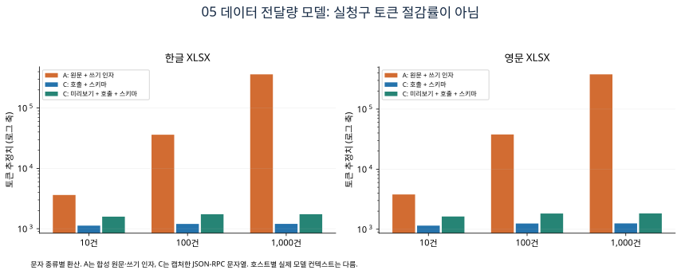
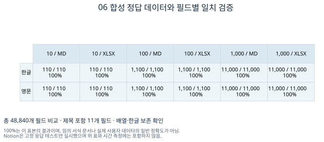
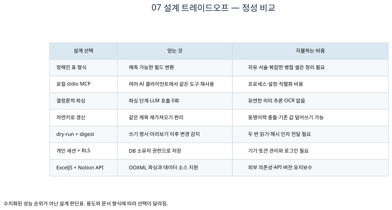

# 경험 정리본 이관을 위한 로컬 MCP 설계와 평가

한국어 학술발표 준비 보고서 · 생성일 2026-09-06T06:48:48.070Z · 합성 데이터 실험

## 1. 연구 질문과 핵심 결론

Excel·Notion 등에 흩어진 경험을 서비스의 구조화 데이터로 옮길 때, 모델이 원문을 읽고 다시 쓰는 중계 단계를 로컬 파싱으로 대체할 수 있는가? 이 기능을 MCP로 제공할 때 어떤 연결 비용과 이식성을 얻는가?

이번 구현은 .xlsx·Markdown·JSON·Notion 페이지/데이터 소스를 같은 저장 파이프라인에 연결한다. 12개 합성 입력 조건에서 필드 48,840개가 정답과 일치했다. MCP는 직접 함수 호출보다 통신 비용을 더한다. 큰 문서를 모델에게 재서술시키는 가정과 비교하면 전달 문자열이 줄지만, 이를 실제 LLM 토큰 소비·과금·작업 시간의 절감으로 해석할 수는 없다.

## 2. MCP 개념부터 실행 원리까지

MCP(Model Context Protocol)는 호스트가 외부 도구의 이름·설명·입력 스키마를 발견하고 호출하는 규약이다. 호스트는 Codex나 Claude Code 같은 사용자 앱이고, 클라이언트는 서버와 연결되는 부분이다. 서버는 파일 읽기·검증·DB 저장 같은 기능을 제공한다. 모델은 호스트가 선택적으로 사용하는 추론 구성요소이며, 이 서버의 파싱 단계에는 모델이 없다. [도구 규격](https://modelcontextprotocol.io/specification/2025-06-18/server/tools)

현재 전송 방식은 stdio이다. 클라이언트가 Node 서버를 자식 프로세스로 실행하고 stdin으로 요청, stdout으로 응답을 받는다. 각 메시지는 한 줄의 JSON-RPC이며 요청 id로 응답을 연결한다. 운영 로그는 stderr로 분리한다. 네트워크 서버를 외부에 공개할 필요가 없다. [stdio 규격](https://modelcontextprotocol.io/specification/2025-06-18/basic/transports)

초기화는 initialize → notifications/initialized → tools/list 순서다. 이후 tools/call로 preview_import를 호출해 소스와 매핑을 검사하고, import_records에 dry_run=false를 명시하면 실제 저장한다. 선택적으로 expected_digest에 미리보기 해시를 보내면 파일 내용이나 매핑이 바뀐 경우 저장 전에 중단한다. db_snapshot은 테이블별 건수를 확인한다.


## 3. 구현과 사용자 경로

1. runner 의존성을 설치하고 MCP 클라이언트에 runner/mcp/server.mjs를 등록한다. 실제 DB 저장 전에는 서비스 설치와 본인 러너 로그인이 필요하다.
2. Excel은 첫 행에 제목·상황·역할·판단·행동·결과·태그 등 열 이름을 둔다. 시트명은 경험 또는 학력 같은 종류로 지정한다. 다른 시트명이라면 section을 전달한다.
3. 열 이름이 다르면 column_map으로 연결한다. 예: `{"활동명":"title","배운 점":"reflection"}`. 원본 셀의 줄바꿈과 # 문자를 행 경계로 재해석하지 않는다.
4. 미리보기에서 skipped·rejected·warnings와 전체 진단 건수를 확인한다. 진단 예시는 최대 20개로 제한한다.
5. 저장 시 같은 자연키의 항목은 갱신한다. 프로필은 현재 프로필을 갱신하므로 미리보기와 only 필터로 범위를 선택한다.

```bash
cd runner
npm install
node mcp/server.mjs preview --source /절대경로/경험.xlsx --section 경험
node mcp/server.mjs import --source /절대경로/경험.xlsx --section 경험 --only experience --write
```

엑셀은 현대 .xlsx 형식만 지원한다. 10 MiB, 시트당 10,000행·100열 제한이며 병합 셀과 수식은 값으로 정리해야 한다. 압축 해제 후 메모리를 엄격하게 제한하는 격리 파서는 아니므로 신뢰할 수 있는 로컬 자료를 대상으로 한다. 숫자로 입력된 식별자의 앞자리 0은 Excel에 이미 없을 수 있으므로 등록번호 같은 값은 텍스트로 입력한다.

Notion 토큰은 runner/.env의 NOTION_TOKEN에서 자동 로드한다. 통합에 해당 페이지의 읽기 권한을 부여한 뒤 notion://page/ID 또는 notion://database/ID를 사용한다. DB에는 section이 필요하다. API 2025-09-03의 data_sources를 조회하고, 데이터 소스가 여럿이면 notion://data-source/ID로 명시하게 한다. 페이지와 DB의 페이지네이션을 처리하고 지원하지 않는 블록·속성은 진단한다. DB 행 본문과 첨부파일, OCR은 대상이 아니다. [Notion API 변경](https://developers.notion.com/guides/get-started/upgrade-guide-2025-09-03)

ExcelJS는 Node 표준 라이브러리에 없는 OOXML ZIP/XML·공유 문자열·날짜·서식 처리를 위해 추가했다. 신규 직접 의존성은 exceljs 4.4.0 하나이며, 간접 의존성 uuid는 수정 버전 11.1.1로 제한했다. npm audit에서 신규 설치 후 확인된 uuid 경고를 해소하고 다시 엑셀 읽기·쓰기 테스트를 실행했다. [ExcelJS](https://github.com/exceljs/exceljs)

## 4. 비교 설계와 지표 정의


| 조건 | 실제 실행 여부 | 의미 |
|---|---|---|
| A 모델 중계 | LLM은 실행하지 않음 | 같은 원문과 저장할 행을 JSON 문자열로 직렬화한 비교 모델 |
| B 직접 호출 | 실제 실행 | 같은 import_records 함수를 같은 파일·dry-run 조건으로 직접 호출 |
| C MCP | 실제 실행 | 별도 Node 프로세스에서 JSON-RPC/stdio로 같은 도구 호출 |

A 대 C 비교에는 **설계 변경(모델 재서술 제거)**과 **MCP 도입**이 함께 들어간다. B 대 C가 MCP 연결 비용을 분리하는 대조군이다. 단순 파일 가져오기만 필요하면 B도 같은 로컬 파싱의 장점을 얻는다. MCP의 기여는 표준 도구 탐색·호출과 클라이언트 재사용이지, 자체적인 토큰 압축 알고리즘이 아니다.

- 입력: 한글/영문 × Markdown/XLSX × 10/100/1,000개 기록 = 12조건. 각 기록은 제목 포함 11개 필드다. 전부 가상 템플릿 데이터다.
- 반복: 조건별 B·C 각각 20회, 워밍업 3회. AB/BA 교대 순서, 병렬 호출 없음. 총 480회 타이밍.
- 시간: performance.now()로 호출부터 결과 수신까지 측정. nearest-rank p50(중앙값)과 p95를 보고한다. 짝수 표본에서 p50은 가운데 두 값의 평균 대신 낮은 쪽 순위값이다. 서버 시작·첫 호출은 results.json에 별도로 기록한다.
- 데이터 정확도: 미리 정한 원본 필드값과 파싱 결과를 문자열·배열 단위로 비교한다. 상태 시간 등 자동 생성 메타데이터는 정확도 대상에서 제외한다.
- 통신량: 실제 MCP 요청·응답 줄의 UTF-8 바이트와 유니코드 문자 수. 초기 도구 목록과 초기화 통신은 별도 보관한다.
- 토큰: 문자 종류별 환산 함수의 **추정값**. 한글 1.5, CJK 1.0, ASCII 3.8, 기타 2.5, 공백 6.0 문자/토큰으로 계산하고 반올림한다. 제공자 공식 토크나이저나 실청구 사용량이 아니다.
- 워크플로 추정: C의 미리보기 요청/응답 + import dry-run 요청/응답 + 도구 스키마 1회. MCP 프로토콜 외피와 token_metrics 필드도 포함한다. 호스트가 모델에게 전달하는 내용과 토큰화는 이 문자열과 다를 수 있다.

계산식: 추정 절감률 = 100 × (1 − C 워크플로 추정 토큰 / A 중계 문자열 추정 토큰). A에는 원문과 모든 행의 쓰기 인자를 포함하고, 실제 모델의 시스템 프롬프트·대화 이력·추론·재시도는 포함하지 않는다. C에도 실제 모델 대화는 없다. 도구 스키마는 한 번 합산했으며 호스트가 여러 턴에 다시 싣는 경우 비용이 커질 수 있다.

환경: Node v26.5.0, darwin arm64, Apple M2. OS 캐시를 강제 제거하지 않았으며 프로세스 부하·라이브러리 초기화에 영향을 받는다. 성능 통계는 단일 머신의 기술 통계이며 유의성 검정이나 일반화 주장이 아니다.

## 5. 측정 결과

아래는 한글 XLSX 조건이다. 전체 한글·영문 결과는 data/results.json, 480회 원시 기록은 data/trials.csv에 있다.

| 기록 수 | 직접 호출 중앙값 ms | MCP 중앙값 ms | MCP p95 ms | A 토큰 추정 | C 전체 워크플로 토큰 추정 | 가정 대비 감소 |
|---|---|---|---|---|---|---|
| 10 | 2.82 | 2.97 | 3.77 | 3,619 | 1,582 | 56.29% |
| 100 | 7.60 | 9.43 | 13.64 | 36,104 | 1,734 | 95.20% |
| 1,000 | 77.02 | 84.36 | 116.59 | 361,431 | 1,740 | 99.52% |




10건은 스키마와 미리보기의 고정 비용 비중이 크다. 1,000건에서는 원문+행 인자 크기가 증가하지만 요약 응답은 제목 예시 20개에서 제한되어 추정 비율이 커진다. 이 숫자는 사용자의 시간·지원 품질·실제 구독 소모량 개선을 검증한 결과가 아니다. XLSX 압축 파일 크기를 LLM 입력 토큰으로 환산하지도 않는다. A에는 셀의 텍스트 내용을 사용했다.



## 6. 검증 범위와 재현

실제 XLSX 생성·읽기, 한글·영문 필드 비교, 날짜, 열 매핑, 줄바꿈, 수식·병합 셀 거부, 잘못된 JSON 진단, digest 변경 거부를 검증했다. 별도 프로세스로 initialize/tools/list/tools/call/dry-run/오류 응답을 실행했다. Notion은 고정 HTTP 응답으로 권한 오류·모호한 데이터 소스·페이지네이션·중첩 블록을 검증했다. 저장 함수의 생성·갱신·일부 실패와 소유자 필터는 메모리 DB 대역으로 검증했다.

**실제 Notion 계정·실제 Supabase 쓰기·실제 AI 제공자 호출은 이번 실험에서 실행하지 않았다.** 기존 서비스의 실데이터를 벤치마크로 변경하지 않았다. Notion API 호환성은 실연동 추가 검증이 필요하고, DB 대역 테스트는 운영 RLS 검증을 대체하지 않는다.

```bash
cd runner
npm ci
node --test test/mcp-import.test.mjs
npm run mcp:research
cd ..
python3 scripts/render-mcp-research.py
```

시각자료 재생성에는 Python matplotlib·numpy·Pillow와 Graphviz dot이 필요하다. 한국어 글꼴은 macOS AppleGothic 또는 Noto Sans CJK KR을 사용한다. 벤치마크는 자체 임시 폴더에 합성 파일을 만들고 종료 후 해당 폴더만 정리한다. benchmark 결과에는 환경 정보·입력 SHA256·raw latency·실제 JSON-RPC payload를 남긴다. 샘플 데이터는 fixtures.mjs로 재생성된다. 시간 수치는 다시 실행할 때 달라진다.

## 7. 트레이드오프와 타당성 위협



- 템플릿 파서는 재현성이 높지만 불규칙한 실제 문서의 의미를 추론하지 못한다. 후속 실험에는 익명화된 실제 사용자 정리본, 잘못된 열 이름, 날짜 형식, 복합 셀을 포함해야 한다.
- stdio는 로컬 파일에 접근하기 편하고 공개 엔드포인트가 필요 없지만, 클라이언트마다 설치·승인을 관리한다. Streamable HTTP는 원격 공유에 유리하나 인증·네트워크 운영이 추가된다.
- 자연키 갱신은 편리하지만 제목 변경은 새 행을 만들 수 있고 동일 제목의 별개 경험은 충돌한다. 현재 여러 프로세스가 동시에 가져올 때 DB 유니크 제약이 없으면 경쟁 조건으로 중복이 생길 수 있다.
- 미리보기 후 저장은 원문을 다시 읽으므로 Notion 호출 비용이 늘어난다. digest는 내용 변경을 감지하지만 DB 트랜잭션이나 전체 롤백을 제공하지 않는다. 일부 행은 성공하고 일부는 실패할 수 있다.
- Excel 파싱 의존성은 직접 OOXML 구현의 오류를 줄이지만 설치 크기와 공급망 관리 비용을 늘린다. 오래된 .xls·OCR·수식 계산·Notion 첨부파일·양방향 동기화는 지원하지 않는다.
- RLS는 사용자 데이터 저장 경계이며 로컬 MCP 자체의 파일 접근 허용 목록은 아니다. 신뢰하는 클라이언트에서 사용자가 선택한 파일만 요청해야 한다. 모델에 원문 전체를 주지 않더라도 제목과 진단 메타데이터는 응답에 포함된다.

## 8. 학술 발표에서 사용할 주장과 후속 실험

발표 가능한 주장: “동일한 구조화 파서를 직접 호출·MCP 호출로 비교했으며, 합성 표본의 필드를 보존하면서 클라이언트 재사용 인터페이스를 제공했다. 원문 재서술을 제거하는 설계의 문자열 비용을 모델링하고, 실제 전송량·시간과 분리해 보고했다.”

아직 사용할 수 없는 주장: “실사용자 생산성이 99% 개선됐다”, “LLM 비용이 실측 99% 감소했다”, “어떤 Notion 문서든 100% 정확하게 가져온다”, “MCP가 직접 호출보다 빠르다”.

후속 실험은 (1) 동의받은 익명 문서와 독립 정답 주석, (2) 같은 모델·버전·프롬프트에서 A/B/C 실행, (3) CLI가 보고한 input/output/cached 토큰과 실제 전체 소요 시간, (4) 실 Notion·Supabase 지연 및 호출 수, (5) 사용자 수정 횟수·작업 완료율, (6) 반복·신뢰구간과 실패 사례 분석을 포함해야 한다. 모델 출력은 변동성이 있으므로 시드·샘플링 설정·실행 일시를 함께 기록한다.

## 9. 시각자료 사용 안내

figures/의 01~07 그림마다 SVG(편집 가능), PDF(벡터 인쇄), PNG(미리보기)를 제공한다. 01·02에는 Graphviz DOT 원본도 있다. 차트의 원시 값은 data/에 있고 이 문서와 그림은 같은 results.json에서 생성된다. HTML 갤러리(index.html)는 오프라인으로 열 수 있다.
